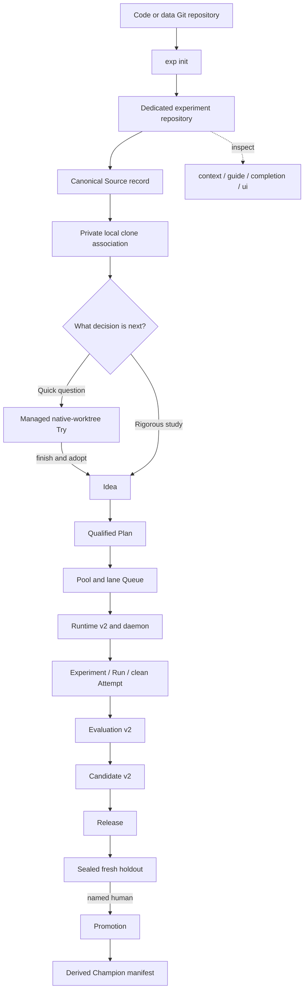
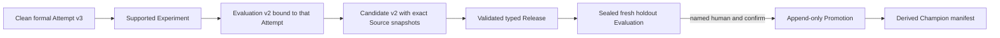
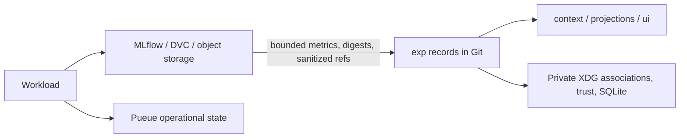

# exp

`exp` is a Git-native research control plane for choosing which experiments
receive scarce compute, running selected work safely, and preserving the path
from a bounded question to a reviewed production decision.

Documentation: [English](https://daviddwlee84.github.io/exp-cli/) ·
[繁體中文](https://daviddwlee84.github.io/exp-cli/zh-TW/)

The recommended layout is a **dedicated private experiment repository** for
canonical research records plus ordinary **Source** records for the code/data
repositories or governed subdirectories being studied. Private host-local
associations locate clones without putting checkout paths in Git history.
Embedded and monorepo Projects remain supported.

## Choose the right flow

| Need | Start with | What it can become |
|---|---|---|
| Answer a short exploratory question now | `exp try run` | A reviewed Try; optionally `exp try adopt` into an Idea |
| Spend governed compute on comparable evidence | `exp idea add` → qualify → Queue → runtime v2/daemon | Experiment → Evaluation v2 → Candidate v2 |
| Move already-qualified evidence toward production | `exp candidate create` → Release → sealed holdout | Named-human Promotion → derived Champion manifest |

A Try is not a cheaper Candidate path. A dirty Try is useful exploration, but
promotion-bearing evidence must be rerun as a clean formal Attempt.



## Set up a dedicated workspace and Source

From the Git repository you want to study, run the TTY wizard:

```bash
exp init
```

It defaults to a sibling dedicated repository and reviews the target, Source,
subdirectory, local-only identity risk, and effects before writing. For an
explicit non-interactive setup:

```bash
SOURCE_REPO="$(git rev-parse --show-toplevel)"
EXP_REPO="$(dirname "$SOURCE_REPO")/$(basename "$SOURCE_REPO")-experiments"

exp init \
  --dedicated-repo "$EXP_REPO" \
  --create \
  --source-repo "$SOURCE_REPO" \
  --source-key app \
  --source-title "Application source" \
  --source-subdir . \
  --name "Application research" \
  --confirm \
  --confirm-local-only
```

`--confirm-local-only` is needed only when no sanitized Git remote identifies
the Source. To add another repository or a governed subdirectory later:

```bash
DATA_REPO="$HOME/src/shared-data"
exp --workspace "$EXP_REPO" source add \
  --key data \
  --title "Shared data definitions" \
  --repo "$DATA_REPO" \
  --subdir datasets \
  --confirm

exp --workspace "$EXP_REPO" source status
```

Use `exp source register SOURCE --repo DIR` after a clone moves or is recreated.
Inspect and approve repository configuration with the same Source context used by
execution. From the Source checkout, run
`exp --workspace "$EXP_REPO" --source app config explain`. A Source-selected
repository-layer trust receipt is scoped to that Source; it is not blanket
approval for every Source. See
[Getting Started](docs/getting-started.md) and
[Configuration and Paths](docs/reference/configuration.md).

## Explore, save, and retrieve

Use a continuing Try for adhoc analysis, including work without an existing
codebase. `try root PATH` remembers a custom scratch collection location.

```bash
exp try start --scratch --title "Inspect latency" --goal "Find patterns worth testing" --json
# Carry the returned Project and Try IDs; write analysis code at source_path.
exp --workspace PROJECT input bind sample /Volumes/data/sample.csv
exp --workspace PROJECT try exec TRY --input sample --dirty=capture -- python3 plot.py
exp --workspace PROJECT try finish TRY --author agent --summary "Latency has two clusters"
exp history search latency --all
exp --workspace PROJECT results open ATTEMPT plots/latency.png
```

Analysis reads `EXP_INPUT_SAMPLE` and writes under `EXP_OUTPUT_DIR`. Each Attempt
has independent outputs and recorded input/binary digests. Storage preferences
persist in private XDG configuration; local directories, local MLflow with
SQLite metadata, and remote MLflow are supported. `results save` repairs pending
publication without rerunning analysis. Agent conclusions are explicitly
unreviewed. See [Adhoc Exploration](docs/workflows/exploration.md).

## Try a bounded question

A fully explicit Try executes argv directly in an exp-managed native Git
worktree; arguments after `--` are never parsed by a shell:

```bash
exp --workspace "$EXP_REPO" --source app try run \
  --title "Probe cosine decay" \
  --goal "Decide whether this direction merits a controlled Experiment" \
  --allow 'src/**' \
  --timeout 20m \
  -- project-runner --config configs/probe.toml
```

Clean is the default. Use `--dirty=capture` only to freeze bounded dirty Source
state for Try-only replay. Inspect with `exp try status`, recover only provably
safe work with `exp try resume`, and conclude explicitly:

```bash
TRY_ID='try_replace_with_returned_id'
exp --workspace "$EXP_REPO" try finish "$TRY_ID" \
  --summary "The direction merits a clean controlled study" \
  --no-results \
  --confirm
```

A concluded Try may be adopted into Idea v2; it never directly backs Candidate
creation. See [Runtime Dispatch](docs/workflows/runtime-dispatch.md).

## Run a rigorous Experiment

Formal work is priced and ordered before dispatch:

```text
Idea v2 -> qualified Plan v2 -> Pool/lane Queue
        -> runtime v2 -> Pueue -> Experiment -> Run -> clean Attempt v3
```

Initialize Policy and capacity, qualify an Idea, then insert its Plan using the
typed IDs returned by each command:

```bash
exp --workspace "$EXP_REPO" policy init
exp --workspace "$EXP_REPO" pool add \
  --title "Local GPUs" --capacity 2 --unit gpu --bottleneck accelerator

POOL_ID='pool_replace_with_returned_id'
exp --workspace "$EXP_REPO" queue create --pool "$POOL_ID"

exp --workspace "$EXP_REPO" idea add \
  --title "Evaluate cosine decay" \
  --summary "Measure the registered optimizer change" \
  --lane explore \
  --cluster optimizer
```

Configure and exact-digest trust `.exp/runtime.json` as `exp.runtime/v2`, inspect
with the provider-free `exp daemon frontier`, then explicitly enable and run the
daemon:

```bash
exp --workspace "$EXP_REPO" daemon frontier
exp --workspace "$EXP_REPO" policy autonomy assisted --confirm-auto-experiment
exp --workspace "$EXP_REPO" daemon run
```

Pueue is required for formal dispatch, not for native Try. Runtime v2 admits only
clean, exact SourceSnapshots and carries explicit Project/Source authority into
the worker. See [Core Research Workflow](docs/workflows/core-workflow.md) and
[Runtime Dispatch](docs/workflows/runtime-dispatch.md).

## Promote clean evidence

Process, scheduler, output-hash, and MLflow success are observations—not a
scientific verdict. The promotion-bearing path is:



Use `exp evaluation spec create`, `exp evaluation create --attempt ATTEMPT`, and
`exp candidate create --attempt ATTEMPT`; then follow the sealed Release and
Promotion gates. No autonomy mode or agent can approve production. See
[Evidence to Promotion](docs/workflows/evidence-to-promotion.md).

## Inspect, discover, and use the UI

```bash
exp context
exp guide
exp guide setup
exp completion --help
exp ui
```

`exp ui` is a read-only local TUI. Startup performs local reads only; explicit
readiness refresh performs bounded probes. It cannot mutate records or trust,
execute work, install/login, start a service, open an editor, or hand off a
workspace. For automation use `exp context --json` and command-specific JSON
envelopes.

`exp doctor` performs local executable lookup only. `exp doctor --live` is an
explicit bounded, read-only version/local-service probe: no install, login,
configuration write, service start, or workload execution. Missing MLflow,
Pueue, or `dev` remains visible in help/doctor and does **not** hide actions or
block a native Try; only the operation that truly needs that tool is unavailable.
The optional `dev_cli` backend's prepare/open/handoff/retire lifecycle remains
unsupported until `dev` exposes schema-versioned exact-path machine capability
receipts, so native Git remains the byte, inspection, and cleanup authority.

Use `exp <command> --help` for syntax, `exp guide TOPIC` for workflow context,
and the [Command Map](docs/reference/command-map.md) for discoverability.

## Keep large bytes out of Git



Large datasets, model checkpoints, artifacts, traces, and unbounded logs stay in
managed local artifact directories, MLflow, DVC, or object storage. Git receives only bounded summaries, cryptographic
digests, exact Source/commit identities, and sanitized provider references.
Credentials, raw environments, host paths, large artifact bytes, and unbounded
provider output never belong in canonical records.

## Install and develop

```bash
git clone https://github.com/daviddwlee84/exp-cli.git
cd exp-cli
make install
exp --version
```

`make install` writes `${PREFIX:-$HOME/.local}/bin/exp` and links the embedded
Agent Skill. The repository pins Go in `mise.toml`; CI checks formatting, vet,
race-enabled tests, builds, generated skill metadata, and bilingual docs.

```bash
mise install
mise exec -- make all
make docs-build
```

Tagged [GitHub releases](https://github.com/daviddwlee84/exp-cli/releases) provide macOS/Linux amd64/arm64 archives, SHA-256 checksums, and Bash/Zsh completions. Verify the matching archive against `checksums.txt` before installing it. Windows and AIX remain source/cross-build targets; these releases do not claim native validation there. See [RELEASING.md](RELEASING.md).

## License

Newly authored source code in this repository is available under the MIT
License; see [LICENSE](LICENSE).

### Source distribution size

Release assets include a rootless source archive (`exp-cli_<version>_source.tar.gz`)
and its checksum. Source archives omit SpecStory history and agent plan folders
using `.gitattributes`; Go module downloads omit the same evidence through nested
`go.mod` boundary markers. Build inputs, embedded resources, tests, licenses, and
skills remain available. Full Git clones retain development history.

CI builds and exercises both a real Git archive and an independently generated Go
module ZIP using the official `golang.org/x/mod` implementation. To run the check
from a committed revision:

```sh
python3 scripts/check-distribution.py
```
