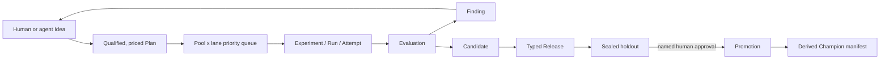

# exp

`exp` is a Git-native autonomous research control plane for deciding which
experiments deserve scarce compute, running selected work safely, and
preserving the path from idea to production decision.

Canonical research meaning lives in ordinary Markdown/TOML records under
`experiments/`. Pueue owns local task execution, MLflow owns workload telemetry,
Git owns code history, and a private SQLite database owns only leases, jobs,
outbox recovery, and scheduling counters.

## Research loop



Ideas, Experiments, and Candidates retain parent edges, while Findings retain
explicit belief-changing edges. A research thread can branch, stop, or merge
without rewriting history. A generated view or manifest is never read back as
authority.

## Safe defaults

- `exp policy init` creates `POLICY.md` in `manual` mode with an 80/20
  exploit/explore allocation. `manual` and `shadow` expose frontiers but do not
  dispatch.
- Moving to `assisted` or `limited` requires
  `--confirm-auto-experiment`. This enables experiment dispatch only.
- Production Promotion always requires a sealed holdout Evaluation, a named
  human approver, and `--confirm`; no autonomy mode bypasses that gate.
- Agent output is advisory and schema-validated. Queue insertion records a
  listwise recommendation and compares adjacent candidates twice with their
  order swapped. Disagreement, abstention, or low confidence leaves queue order
  unchanged for human review.

## Quick start

Initialize the canonical root and policy, then name the constrained resource:

```sh
exp init --name "Encoder research"
exp policy init
exp pool add \
  --title "Local GPUs" \
  --capacity 2 \
  --unit gpu \
  --bottleneck accelerator
```

Use the returned ResourcePool ID to create the queue, then capture and qualify
an Idea. Qualification atomically creates an `exp.plan/v2` with resource cost,
expected utility, classification, and revision-pinned Finding dependencies.
Autonomous admission currently requires exactly one ResourcePool need; model
coupled GPU/CPU/memory reservations as one composite pool.

```sh
# Replace each example after its creation command prints the real ID.
POOL_ID='pool_01a01e66-f8e0-7202-8000-000000000202'
exp queue create --pool "$POOL_ID"
QUEUE_ID='queue_01a01e67-e340-7303-8000-000000000303'

exp idea add \
  --title "Try cosine decay after warmup" \
  --summary "Reduce late-stage optimizer noise" \
  --lane exploit \
  --cluster optimizer
IDEA_ID='idea_01a01e68-e340-7404-8000-000000000404'

exp idea qualify "$IDEA_ID" \
  --payoff-summary "Improve validation macro-F1" \
  --payoff-metric macro_f1 \
  --payoff-unit score \
  --probability 0.45 \
  --impact 0.02 \
  --information-value 0.005 \
  --resource "$POOL_ID":1:3
PLAN_ID='plan_01a01e69-e340-7505-8000-000000000505'

exp queue insert "$QUEUE_ID" "$PLAN_ID" --pool "$POOL_ID"
exp context
```

`queue insert --agent` adds global listwise advice and order-swapped adjacent
battles. Without `--agent`, the transparent numeric score determines stable
insertion. Queue order is canonical; each entry pins the Plan revision used to
rank it.

New belief-changing Findings or an edited queued Plan intentionally make its
pins stale and block dispatch. After review, `exp plan refresh PLAN` requires a
complete utility reassessment, repins current Finding revisions/belief digests,
and removes the Plan from its Queue. Run `queue insert` again for a fresh
score/battle before dispatch.

```sh
exp plan refresh "$PLAN_ID" \
  --probability 0.35 --impact 0.02 \
  --information-gain 0.01 --unblock-value 0 --risk-penalty 0.005
exp queue insert "$QUEUE_ID" "$PLAN_ID" --pool "$POOL_ID" --agent
```

## Human and agent Ideas

Humans can qualify an Idea directly. A human can also supply only the direction
and ask one fresh, single-shot CLI agent to propose the complete Plan:

```sh
exp idea develop "$IDEA_ID" --json
exp idea develop "$IDEA_ID" --apply --json
```

Agent profiles default to `$XDG_CONFIG_HOME/exp/agents.toml`. The executable is
resolved from `PATH`; placeholders occupy a complete argument and every run
must return exactly one JSON value matching the supplied schema. The
`research-agent` name below stands for a user-configured wrapper.

```toml
schema = "exp.agents/v1"

[roles]
idea_planner = "research-agent"
queue_advisor = "research-agent"
queue_battle = "research-agent"
experiment_implementer = "research-agent"

[profiles.research-agent]
executable = "research-agent"
args = ["--prompt", "{prompt_file}", "--schema", "{schema_file}", "--output", "{output_file}"]
timeout = "10m"
max_output_bytes = 1048576
output = "output_file_json"
stdin_prompt = false
allowed_env = []
secret_env = []
reported_model = "configured-outside-exp"
```

Inspect the config or run a profile against an arbitrary JSON Schema with
`exp agent profiles` and `exp agent run`. `exp` starts a new process for every
request; it has no provider SDK session and does not persist hidden agent state.

## Runtime dispatch

`.exp/runtime.json` is the strict, project-local runtime contract. It binds
canonical ResourcePools to Pueue groups and queue-ready Plans to an exact
executable, argument vector, Git base/head, and changed paths. It contains
only explicitly allowed non-secret, non-credential-sensitive environment
variable names. Pueue persists task environments, so `secret_env` must be empty; workloads needing credentials
must use a workload-side broker or provider profile. Absolute executable paths
may be host-specific, so teams should choose deliberately whether to track it.
Within one Pueue group, pool label prefixes must be pairwise prefix-free and
short enough for the worktree-scoped dispatch suffix. The selected runtime
config path itself is control metadata and cannot appear in a Plan ChangeSet.

```json
{
  "schema_version": "exp.runtime/v1",
  "pools": {
    "pool_01a01e66-f8e0-7202-8000-000000000202": {
      "pueue_group": "gpu",
      "label_prefix": "exp-"
    }
  },
  "plans": {
    "plan_01a01e69-e340-7505-8000-000000000505": {
      "executable": "/opt/project/bin/train",
      "argv": ["--config", "configs/cosine.toml"],
      "checkout": "main",
      "cwd": ".",
      "timeout": "4h",
      "allowed_env": ["CUDA_VISIBLE_DEVICES"],
      "secret_env": [],
      "base_commit": "0000000000000000000000000000000000000000",
      "head_commit": "1111111111111111111111111111111111111111",
      "change_set": ["configs/cosine.toml", "src/train.go"],
      "expected_outputs": ["outputs/metrics.json"]
    }
  }
}
```

Set `checkout` to `registered_worktree` to execute the unique linked worktree
whose HEAD equals `head_commit`; no host path is persisted in the config. Before
dispatch, `exp` verifies the repository identity, clean executable tree, exact
HEAD, base ancestry, and exact `base_commit..head_commit` path set. The worker
also requires every `expected_outputs` file and records its SHA-256 digest.
Git verification is applied to queued work and active prepared Attempts;
obsolete config entries for completed or dropped Plans cannot block unrelated
frontier work.

`exp daemon frontier` is local and does not contact Pueue. `exp daemon tick`
performs one reconciliation/admission pass; `exp daemon run` repeats until
cancelled. Capacity comes from named ResourcePools. Weighted fairness targets
the configured exploit/explore shares (80/20 by default) and borrows idle
capacity when only one lane has eligible work.

The daemon uses a lease and fencing tokens, writes an outbox before submission,
and recovers a submission by its worktree-scoped stable Pueue label. The private database is at
`<git-common-dir>/exp/runtime/v1/control.sqlite`. The hidden worker publishes a
bounded frozen result and durable terminal marker before updating SQLite, so
replay does not execute a completed claim again. Canonical recovery can verify
those markers even if the rebuildable SQLite database is lost.

Pueue remains authoritative for task/group state. Workloads remain responsible
for creating and logging their own MLflow runs; `exp provider mlflow verify`
only reads requested metrics/tags from an explicit run ID. Scheduler or process
success may update operational Attempt state, but it never creates a scientific
verdict, Finding, Candidate, Release, or Promotion.

## Isolated code changes

An experiment agent can work on a dedicated Git branch and linked worktree:

```sh
EXPERIMENT_ID='exp_01a01e6a-e340-7606-8000-000000000606'
BASE_COMMIT='0123456789abcdef0123456789abcdef01234567'

exp experiment workspace prepare "$EXPERIMENT_ID" \
  --base "$BASE_COMMIT" \
  --allow 'src/**' \
  --allow 'configs/**'

exp experiment workspace commit "$EXPERIMENT_ID" \
  --base "$BASE_COMMIT" \
  --allow 'src/**' \
  --allow 'configs/**'

# Or run the configured experiment_implementer agent and commit automatically.
exp experiment agent "$EXPERIMENT_ID" \
  --base "$BASE_COMMIT" \
  --allow 'src/**' \
  --allow 'configs/**' \
  --prompt implementation-notes.md
```

The commit command stages only the observed, allowlisted paths, rejects
`experiments/` and Git metadata, creates one exact experiment commit, and
returns its base, head, paths, and diff digest. It never merges or removes the
worktree; a human controls integration into the main branch.

This command prepares code; it does not create execution evidence. Its commit
can become a Candidate only after a successful direct Attempt for an included
Run records the same head and ChangeSet. Normally, integrate it into a child
Idea/Plan runtime and dispatch that follow-up.

## Evidence, combinations, and production

`exp experiment close --input ...` atomically closes an Experiment, completes
its Plan, records included/excluded Run dispositions, and publishes any
Findings. An operational failure is not a refuted hypothesis, and `invalid`
means the evidence cannot answer the registered question.

```json
{
  "schema_version": "exp.request.experiment-close/v1",
  "experiment": "exp_...",
  "plan": "plan_...",
  "verdict": "supported",
  "summary": "The registered change improved the primary metric.",
  "evidence": [
    {"run": "run_...", "disposition": "included", "reason": "Comparable run"}
  ],
  "findings": [
    {
      "title": "Cosine decay helps after warmup",
      "statement": "Under the registered setup, cosine decay improved macro-F1.",
      "scope": "encoder-v2 / validation-v1",
      "evidence": [{"run": "run_...", "detail": "Primary comparable run"}]
    }
  ]
}
```

```sh
exp experiment close --input close.json
exp evaluation spec create \
  --title "Scientific gate" --purpose scientific \
  --dataset validation-v1 --protocol "Fixed evaluator" \
  --metric 'macro_f1:score:maximize:0.90' \
  --pool "$POOL_ID" --budget-hours 1
exp evaluation create \
  --title "Candidate result" --spec evalspec_... --subject exp_... \
  --outcome passed --metric 'macro_f1=0.91:score' \
  --summary "Passed the registered threshold"
exp candidate create \
  --title "Cosine candidate" --experiment exp_... --evaluation eval_... \
  --git-commit "$HEAD_COMMIT" --change configs/cosine.toml --change src/train.go
```

Create an immutable scientific Evaluation before turning a supported result
into a Candidate. A Candidate also requires a successful direct Attempt for an
included conclusion Run with the same full Git commit and exact ChangeSet. It
pins that evidence lineage and optional parent Candidates. Releases are target-specific
sets of named slots: a quantitative system might use `signal`, `risk`,
`portfolio`, and `execution`, while a monolith may use `main`.

Independent improvements are not assumed additive. A Release with multiple
Candidates stores both a separately supported combination Experiment and its
passing scientific Evaluation. Production
then follows:

```text
EvaluationSpec -> Evaluation -> Candidate -> typed Release
              -> sealed PromotionSpec -> fresh holdout Evaluation
              -> human Promotion -> derived Champion manifest
```

`exp champion manifest` renders the current accepted Releases for downstream
consumers. The append-only Promotion chain remains the authority.

A Release request uses named slots and makes combination evidence explicit:

```json
{
  "schema_version": "exp.request.release-create/v1",
  "title": "Quant stack v7",
  "target": "production",
  "version": "v7",
  "state": "draft",
  "slots": [
    {"name": "signal", "candidate": "cand_..."},
    {"name": "risk", "candidate": "cand_..."}
  ],
  "combination": {"experiment": "exp_...", "evaluation": "eval_..."}
}
```

For production, create a promotion-purpose EvaluationSpec with thresholds and
`--sealed`, create the PromotionSpec, then run a fresh Evaluation of the
validated Release after that seal. Only then append the named human decision:

```sh
exp promotion spec-create \
  --title "Production v7 gate" --target production \
  --evaluation-spec evalspec_... --holdout-budget-hours 1
exp evaluation create \
  --title "Fresh sealed holdout" --spec evalspec_... --subject rel_... \
  --outcome passed --metric 'macro_f1=0.91:score' \
  --summary "Passed the sealed holdout"
exp promotion append \
  --title "Promote v7" --target production --spec promspec_... \
  --challenger rel_... --evaluation eval_... --outcome accepted \
  --approved-by 'human:david' --confirm
exp champion manifest --target production
```

## Storage and recovery

Canonical multi-record mutations use a prepared, hash-checked journal under the
Git common directory. Exact candidate bytes become durable before the first
canonical rename. Recovery always rolls forward when a destination matches the
recorded old or new hash and stops on an unrelated edit; run
`exp record recover` to recover explicitly. Generated projections are rebuilt
after canonical commit and are never transaction participants.

Committed journals are retained only as a bounded diagnostic tail, and a crash
before journal publication leaves staging that can be safely removed. The
public `record transaction` surface is intentionally limited to low-risk Idea
and ResourcePool edits; lifecycle records must use their domain commands.

`README.md`, `ROADMAP.md`, `LEDGER.md`, and `DECISIONS.md` inside
`experiments/` are deterministic projections. `exp validate` checks canonical
records and graphs; `exp render --check` compares exact projection bytes.

## Optuna and harness-v0

The provider-neutral `exp.search-adapter/v1` contract defines idempotent
open/ask/tell/prune/observe operations for an Optuna-like Study. A Study is
strictly inside one Plan revision: it may choose parameters and prune trials,
but it never owns the global queue, ResourcePool allocation, Findings,
Releases, or Promotions. A concrete Optuna adapter is intentionally deferred.

Migration from the earlier experiment-knowledge-harness is explicit and
fingerprinted:

```sh
exp migrate plan --source experiments --output draft.json
exp migrate plan --source experiments --resolutions resolutions.json --output reviewed.json
exp migrate apply --plan reviewed.json
```

Planning is read-only unless `--output` is supplied. Apply accepts only a fully
reviewed plan, rechecks every source hash, archives exact legacy bytes, and uses
a recoverable root swap. Migration is never automatic and never executes a
legacy script.

## Machine output and embedded guidance

Commands advertising `--json` emit one `exp.cli/v1` envelope on stdout. Agents
should use complete typed IDs and revisions from that envelope, never scrape
human tables or generated projections. `exp <command> --help` is authoritative
for all flags.

`exp --skill` and `exp skill print` expose guidance embedded in the same binary.
`exp skill install` installs it; `exp skill check` detects drift. Maintainers use
`exp skill sync --check` or `make skill-check` to verify the generated command
reference.

## Development

The repository pins Go 1.26.4 in `mise.toml`.

```sh
mise install
mise exec -- make all
./exp --version
```

CI runs formatting, vet, race-enabled tests, versioned builds, and portability
checks.

## License

Newly authored source code in this repository is available under the MIT
License; see [LICENSE](LICENSE).
