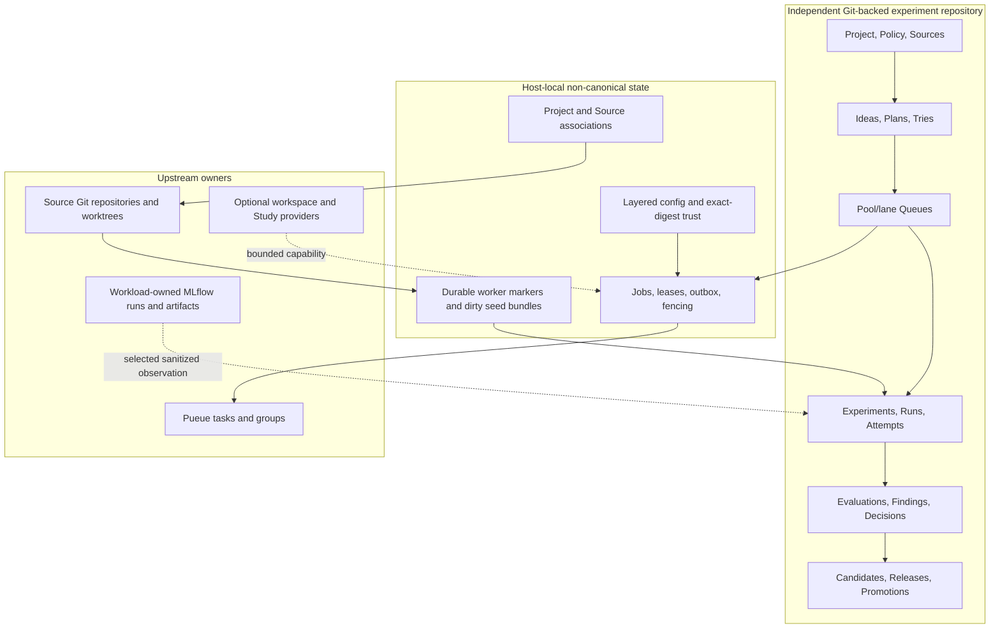
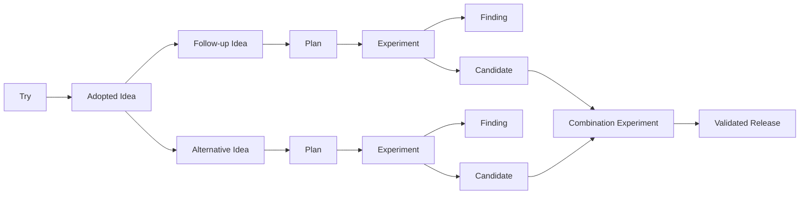

# Architecture

## Product boundary

`exp` is a Git-native research control plane. It chooses, records, dispatches,
and preserves research work; it does not replace Git, schedulers, telemetry
systems, artifact stores, or production deployment systems.

A Project's canonical records and the code they study do not have to share a Git
repository. The canonical **experiment repository** is an ordinary Git
repository containing `experiments/PROJECT.md`. Each canonical `Source` record
names a project-local Git source identity; private host-local associations map
that identity to a checkout. A `Try` is bounded exploratory work. Formal
`Experiment`/`Run` execution is the promotion-bearing path.



Process success is an operational fact, never a scientific verdict. Invalid
evidence is not a refuted hypothesis. A provider artifact URI is an observation,
not canonical content or deployment authority.

## Authority matrix

| Information | Authority | `exp` treatment |
|---|---|---|
| Project identity and canonical research graph | `PROJECT.md` and typed records in the selected experiment repository | Resolve one Project first; validate exact schemas/revisions and mutate under its Git-common lock. |
| Source identity, immutable semantic subdirectory, lifecycle, and sanitized locator hints | canonical `Source` | Keep it path-free and host-independent. A Source is an ordinary record, not a second root or repository mount. |
| Local Project/Source checkout mapping | `$XDG_STATE_HOME/exp/associations/v1.json` | Validate Project UUID, Source ID, Git-common path/filesystem identity, subdir, and locator intersection on every use. Never establish canonical identity from this file. |
| Config selection and execution-bearing preferences | layered `exp.config/v1` files plus `$XDG_STATE_HOME/exp/trust/v1.json` | Resolve only after authority; retain leaf provenance; require exact file digest, capability, Project/Source scope, and Git-common filesystem identity. |
| Autonomy, taxonomy, queue formula, lane allocation, promotion gate | canonical `POLICY.md` | Mutate with revision checks. |
| Proposal, exploratory question, and formal qualification | canonical Idea, Try, and Plan | Keep Try separate from formal evidence; atomically adopt a concluded Try as Idea v2 only with a named human. |
| Pool capacity and queue order | canonical ResourcePool and Queue | Dispatch from the exact pool/lane frontier. |
| Listwise advice and pairwise comparisons | canonical QueueAdvice and Battle | Immutable audit input; never hidden mutation authority. |
| Scientific protocol and conclusion | canonical Experiment | Lock design before Attempts; close only through an explicit transaction. |
| Intended evidence unit | canonical Run | Keep separate from retries and process invocations. |
| Redacted execution identity and state | canonical Attempt | V3 owns exactly one Run or Try and carries SourceSnapshots; import terminal observations explicitly. |
| Metric protocol and measured result | canonical EvaluationSpec and Evaluation | Evaluation v2 binds formal evidence to an exact successful Attempt. |
| Belief and belief-changing relation | canonical Finding | Derive weakened/overturned state from incoming edges. |
| Reusable evaluated result | canonical Candidate | Candidate v2 copies clean Source identities from its formal Attempt and requires an Evaluation v2 bound to the same Attempt. |
| Downstream composition and production decision | Release and append-only Promotion chain | Require combination evidence, sealed holdout, and named human approval. |
| Current production selection | derived Champion | Render a manifest; never read it back as authority. |
| Commits, branches, worktrees, and integration | native Git | Pin full object IDs and exact changed paths. `exp` never automatically merges or pushes. |
| Live task/group state | Pueue | Observe and reconcile through the bounded adapter; never copy raw environments. |
| Runs, metrics, traces, artifacts, and registry state | workload-owned MLflow or another provider | Read selected fields and retain only a verified sanitized reference. Artifact bytes remain outside `exp`. |
| Leases, jobs, outbox, fairness, provider observations | private SQLite | Coordinate local execution; never establish scientific meaning. |
| Generated pages, manifests, and TUI rows | canonical records plus bounded local observations | Treat as read-only projections. The TUI has no mutation, login, install, service-start, editor, or handoff key. |

## Recommended repository arrangement { #recommended-repository-arrangement }

The default recommendation is a **dedicated private experiment repository**. It
keeps canonical research history, trust review, and access policy independent
from any one code repository, while one Project can declare several Sources.
Interactive `exp init` offers this layout first; non-interactive dedicated setup
uses `--dedicated-repo`, `--source-repo`, `--source-key`, and `--confirm`.
Initialization can adopt an exact Git root or, with explicit `--create`, initialize
a reviewed missing/empty target. It creates no remote, commit, submodule, or push.
The dedicated repository and initial Source must have different Git-common
identities.

A Git submodule is optional checkout convenience only. It can make an experiment
repository and a code checkout visible in one parent tree, but submodule placement
is not Source identity, association state, or execution authority. The ordinary
Source record and validated local association remain required.

A monorepo or embedded `experiments/` directory remains supported when code and
research share governance, and preserves backward compatibility with existing
v1 projects. Each Source's immutable `subdir` selects its semantic root inside
its Git repository; `.` selects the repository root. Multiple Source records can
represent several repositories or several governed subdirectories, and each Try
or formal runtime explicitly declares the Source set it uses.

Every canonical Project still has exactly one discovered root at
`<experiment-git-root>/experiments/PROJECT.md`; “independent” means that this Git
repository may differ from the Source repositories, not that Project v1 searches
arbitrary marker paths.

## Research DAG and policy

The linear evidence chain remains valid inside a larger DAG:



Forward edges have one canonical owner. Reverse edges and consolidated trees are
projections. History is not rewritten when a branch fails or is superseded.
Plan v2 dependencies pin both a Finding revision and a belief digest that also
covers incoming `weakens`/`overturns` edges. New belief-changing evidence can
therefore stale a Plan and Queue entry without editing the referenced Finding.

`POLICY.md` defaults to `manual` with an 80/20 exploit/explore allocation.
`manual` and `shadow` expose frontiers but do not admit work. `assisted` and
`limited` permit dispatch only after the explicit policy confirmation; the
current dispatcher otherwise treats them alike. Production Promotion is outside
this autonomy axis and remains human-only.

A Queue owns ordered `(ResourcePool, lane)` partitions. Exactly one Queue may own
a given partition, and a Plan occurs at most once project-wide. Ranking combines
expected utility, information gain, unblock value, risk, pool-hours, and bounded
aging. Agent listwise advice and order-swapped adjacent battles are recorded;
abstention, disagreement, low confidence, or a policy tie leaves the incumbent
order unchanged.

## Execution paths

### Direct Try

`exp try run` resolves one active Source, captures its exact current state, and
publishes a Try plus planned Attempt v3 before creating a job or worktree. It
passes argv directly, never a shell string. The managed workspace is read-only
unless `--allow` globs authorize Source-subdir-relative changes.

Clean mode rejects any tracked, untracked, or submodule dirt. Dirty work is never
implicit: `--dirty=capture` is Try-only and records a bounded SourceSnapshot plus
a private authenticated seed bundle under the XDG cache. Capture rejects paths
outside the Source subdir, ambiguous rename/copy state, unsupported index flags,
dirty or nested submodules, symlinks/non-regular nodes, and hard size/count
limits. The managed worktree must round-trip to the exact seed before execution
and before destructive cleanup.

The direct job runs locally through the private operational store, not Pueue. A
lease heartbeat and durable worker-terminal marker make resume conservative:
`resume` reuses only a provably unstarted Attempt or imports a verified marker;
it never reruns an uncertain execution. `retry` creates one new Attempt v3 only
after the latest Attempt is terminal and preserves Source state, cwd, argv, and
execution Source through `retry_of`. Explicit reconciliation is required to
abandon an unknown Attempt without terminal evidence.

A Try can be concluded or abandoned only after all owned Attempts are terminal.
Selected result digests must belong to those Attempts. Adoption creates Idea v2
and the reciprocal Try state in one transaction. Neither clean nor dirty Try
evidence can directly back a Candidate; a promising dirty Try must be rerun
through the clean formal path.

### Formal runtime v1 and v2

`.exp/runtime.json` remains a strict, non-secret, project-local execution
contract with two separate closed decoders:

- `exp.runtime/v1` is the embedded-repository compatibility contract. It binds a
  Plan to one repository's `main` or `registered_worktree`, top-level Git
  base/head/ChangeSet, executable, argv, cwd, environment-name allowlist, and
  expected outputs; it creates Attempt v2.
- `exp.runtime/v2` is Source-aware. It names one writable `execution_source` and
  zero or more `read_only_sources`, each with `main`, `registered_worktree`, or
  `managed_worktree` checkout, full base/head IDs, exact ChangeSet, and explicit
  no-change observation when applicable. Cwd and expected outputs are relative
  to the execution Source's canonical subdir; ChangeSets remain Git-root-relative.
  It creates Attempt v3.

Runtime v2 dispatch requires an exact `runtime.dispatch` trust receipt for the
raw runtime-file digest. It resolves every canonical Source through its local
association, loads the execution Source's layered config, captures only clean
SourceSnapshots, and optionally prepares deterministic managed worktrees. A
missing, stale, dirty, mismatched, or untrusted Source blocks before scheduler
submission; recovered outbox work is revalidated and becomes `blocked` rather
than being optimistically submitted.

The controller atomically creates Experiment, Run, and Attempt, starts the Plan,
and removes the exact Queue frontier before private job/outbox creation. It then
submits an argv-only worker command to Pueue. Runtime v2 supplies the hidden
worker with explicit `--canonical-root`, `--project`, and checkout-local `--scope`.
The worker first re-discovers that exact Project, verifies scope and metadata-only
job authority/fencing, and only then reads the job payload. The v2 payload binds
Project, canonical scope, execution Source, all private checkout paths, and all
canonical snapshot digests; non-execution Sources are read-only and are
reverified after a successful process.

The worker uses a minimal environment, hashes declared outputs, freezes bounded
result JSON, and durably publishes its terminal marker before SQLite completion.
A valid final marker or recoverable `.tmp` marker plus matching frozen result can
repair interrupted SQLite state without running the workload twice. No missing
marker, expired lease, or ambiguous scheduler observation proves retry safety.
The daemon may reconcile Attempt operational state; it never closes an
Experiment, selects evidence, writes a Finding, creates an Evaluation/Candidate,
or approves Promotion.

## Git workspace and provider boundary

Native Git is the byte and lifecycle authority. Identity-aware branches and XDG
worktree paths include the complete Project, Source, and owner IDs. Preparation
pins an exact full commit, revalidates Source Git-common identity, keeps worktrees
outside registered checkouts, and rejects canonical metadata and paths outside
the allowlist. Formal agent commit creation is limited to an Experiment owner,
stages exactly observed allowed paths, and creates one single-parent commit.

Native inspection always verifies repository, branch, ancestry, path, metadata,
and allowlist state. Normal cleanup removes only a clean worktree still at base.
Dirty Try cleanup may use Git's force removal only after two exact private-seed
verifications. Cleanup removes the worktree and private seed but deliberately
retains the branch, commits, operation rows, and terminal markers. Preparation
markers allow cleanup of only an authenticated incomplete prepare.

The workspace registry exposes `native_git` and optional `dev_cli`. Current
`dev_cli` releases provide no schema-versioned exact-path machine lifecycle
receipt, so prepare, inspect, cleanup, open, handoff, and retire all fail closed as
unsupported. A trusted selection may explicitly fall back to `native_git` where
policy permits. Regardless of the requested provider, native Git owns verification,
inspection, and cleanup; provider-local catalog/task IDs are never canonical.

## Evaluation, artifacts, and Promotion

An EvaluationSpec defines the comparable dataset/protocol, metrics, thresholds,
budget, and purpose. Evaluation v2 is available only for an Experiment subject
and requires a successful terminal formal Attempt v3 whose Run belongs to that
Experiment. Candidate v2 requires that Evaluation to bind the same Attempt,
requires the Experiment conclusion to include the Attempt's Run, rejects every
dirty snapshot, and copies each Source ID, head commit, and exact ChangeSet.
Candidate v1 remains a closed legacy path backed by a matching successful Attempt
v2.

MLflow profiles contain a binary name, non-secret context, timeout, environment
**names and policy only**, and default metric names. Workloads own run creation
and logging. `exp` performs bounded read-only description; provider absence or an
unverified optional worker observation does not turn a successful workload into
a failure. Only exact verified Attempt ownership becomes an ExternalRef. Artifact
URIs are sanitized identity hints; artifact bytes are never downloaded into
canonical records or treated as promotion authority.

A Release fills typed slots with Candidates. Multiple distinct Candidates require
a supported combination Experiment and Evaluation. Promotion uses a separately
sealed promotion-purpose EvaluationSpec, fresh finite holdout, append-only chain,
and named human approval. The current Champion and `exp.champion-manifest/v1` or
Source-aware v3 output are derived views only.

## Storage and recovery boundary

Canonical records live in the selected experiment repository:

```text
experiments/
├── PROJECT.md, POLICY.md
├── sources/, ideas/, plans/, resource-pools/, queues/
├── queue-advice/, battles/, evaluations/, findings/, decisions/
├── candidates/, releases/, promotion-specs/, promotions/
├── t-<full-try-uuid>-<slug>/
│   ├── TRY.md
│   └── attempts/
└── e-<prefix>-<slug>/
    ├── REPORT.md
    ├── runs/
    └── attempts/
```

All linked worktrees of that experiment clone coordinate through its Git common
directory. New compound writes use worktree-scoped
`<git-common-dir>/exp/v1/transactions-v2/` journals with
`exp.transaction/v2`; the old `transactions/` namespace remains readable under
strict compatibility rules. V2 includes a path-free worktree identity, so a
prepared journal is recovered only by its owning worktree. Exact old/new byte
hashes make recovery roll forward or stop on a third value. Projections are
regenerated only after canonical commit.

Separate local state includes:

```text
$XDG_STATE_HOME/exp/associations/v1.json
$XDG_STATE_HOME/exp/trust/v1.json
$XDG_CACHE_HOME/exp/source-seeds/
$XDG_DATA_HOME/exp/worktrees/
<experiment-git-common-dir>/exp/runtime/v1/control.sqlite
<experiment-git-common-dir>/exp/v1/attempts/
```

None is Git-backed scientific authority. See
[Storage and transactions](transactions.md) and
[Configuration and paths](../reference/configuration.md).

## Read-only TUI

`exp ui` renders Workflow, Workspace, Tries, Queue, Attempts, Candidates, and
Readiness tabs from immutable sanitized snapshots. Startup reads canonical
records, associations, config provenance, and an existing operation database in
read-only mode; it does not create that database. Readiness probing occurs only
when that tab is explicitly entered/refreshed and performs bounded local probes
without install, login, service start, workload execution, or canonical writes.
Generation/identity fences discard stale asynchronous responses. Machine callers
use the ordinary `--json` commands; `exp ui` itself requires terminal stdin/stdout
and has no JSON mode.

## Non-goals and remaining limits

The current implementation does not:

- automatically merge, push, deploy, or roll back a Git branch or Champion;
- infer scientific validity from process, scheduler, MLflow, or artifact state;
- permit an agent, autonomy mode, TUI, or provider to approve Promotion;
- use `dev_cli` lifecycle operations until an exact schema-versioned machine
  receipt exists; native Git remains prepare/inspect/cleanup authority;
- provide a large-artifact store, mirror raw telemetry/logs, or persist artifact
  bytes and raw environments;
- promote a dirty Try directly—a clean formal rerun and typed Evaluation are
  required;
- discover multiple canonical Project roots in one Git repository or create
  canonical relationships across different Project UUIDs;
- provide a concrete Optuna runtime, universal cloud scheduler/registry, or
  dynamic Go plugin ABI;
- execute legacy harness scripts during migration.
