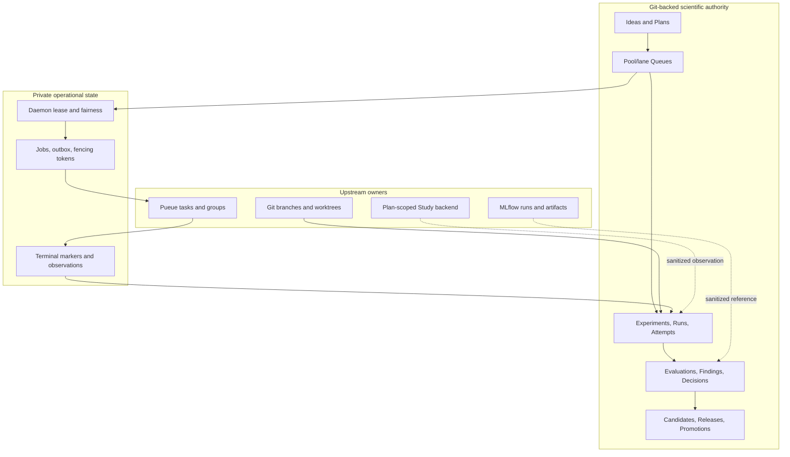
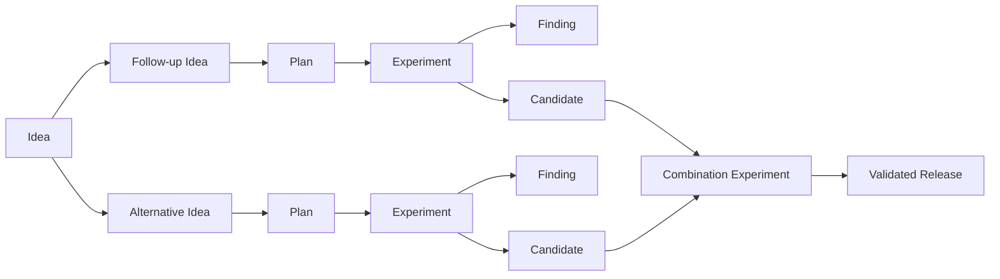

# Architecture

## Product boundary

`exp` is a Git-native research control plane. It chooses and records research
work; it does not replace the systems that execute code, store telemetry, or
serve production artifacts.



Process success is an operational fact, never a scientific verdict. Invalid
evidence is not a refuted hypothesis.

## Authority matrix

| Information | Authority | `exp` treatment |
|---|---|---|
| Autonomy, taxonomy, queue formula, lane allocation, promotion gate | canonical `POLICY.md` | Mutate with revision checks |
| Human/agent proposal and parent Ideas | canonical Idea | Preserve origin and qualification state |
| Expected utility, constrained resources, assumptions | canonical Plan | Queue only a fully qualified Plan |
| Pool capacity and queue order | canonical ResourcePool and Queue | Dispatch from exact pool/lane frontier |
| Listwise advice and pairwise comparisons | canonical QueueAdvice and Battle | Immutable audit input; never hidden authority |
| Scientific protocol and conclusion | canonical Experiment | Lock design; close only through explicit transaction |
| Intended evidence unit | canonical Run | Keep separate from retries/process invocations |
| Redacted execution identity and operational state | canonical Attempt | Reconcile explicitly from durable observations |
| Metric protocol and measured result | canonical EvaluationSpec and Evaluation | Immutable, comparable evidence |
| Belief and belief-changing relation | canonical Finding | Derive weakened/overturned status from incoming edges |
| Reusable evaluated result | canonical Candidate | Pin Experiment, Evaluation, Git commit, and ChangeSet |
| Downstream composition | canonical typed Release | Require combination evidence for multiple Candidates |
| Production decision | append-only Promotion chain | Require sealed holdout and named human approval |
| Current production selection | derived Champion | Render; never read manifest back as authority |
| Code history and integration | Git | Agent may create exact experiment commit; human merges |
| Live local task/group state | Pueue | Observe/reconcile through adapter; never copy raw envs |
| Metrics, traces, artifacts, registry | workload-owned MLflow or other provider | Verify selected fields; retain sanitized references |
| Leases, jobs, outbox, fairness, provider observations | private SQLite | Durable local coordination, never scientific authority |
| Search trials and pruning inside one Plan | configured Study backend | Provider-neutral adapter boundary; no global priority |
| Generated README/roadmap/ledger/decision/champion views | canonical records | Deterministic projections only |

## Research DAG

The linear evidence chain remains valid inside a larger DAG:



Forward edges have one canonical owner. Reverse edges and consolidated trees
are projections. History is not rewritten when a branch fails, is superseded,
or becomes an input to a later combination.

Finding dependencies in Plan v2 pin both the Finding revision and a belief
digest. That digest includes incoming `weakens` and `overturns` edges, so new
belief-changing evidence makes dependent Plans and Queue entries stale even if
the target Finding file itself did not change.

Exactly one canonical Queue may own a given ResourcePool/lane partition. This
keeps each constrained frontier globally ordered instead of letting Queue ID
ordering starve a higher-value Plan in another Queue.

## Policy and autonomy

`POLICY.md` is an ID-less singleton. Its default is `manual` and an 80/20
exploit/explore allocation.

| Mode | Frontier visibility | Automatic experiment dispatch |
|---|---:|---:|
| `manual` | yes | no |
| `shadow` | yes | no |
| `assisted` | yes | yes, after explicit confirmation |
| `limited` | yes | yes, after explicit confirmation |

The current dispatcher treats `assisted` and `limited` as dispatch-enabled
policy modes; downstream deployments may use the distinction for additional
review conventions. Changing either mode requires
`--confirm-auto-experiment`. Production Promotion is outside this autonomy
axis and always remains human-only.

Policy also owns controlled `domain`, `work`, `method`, and `component`
vocabularies; lane, risk, horizon, origin, cluster saturation thresholds, score
formula version, and tie behavior. Free discovery labels remain in `tags`.

## Queue admission

A Queue contains ordered partitions identified by `(ResourcePool, lane)`. A
Plan appears at most once across all Queues and pins the exact normalized Plan
revision used for ranking.

Transparent scoring estimates:

```text
(probability × impact + information gain + unblock value - downside)
--------------------------------------------------------------------- + aging
                         pool-hours
```

The ranking layer supports bounded intervals; Plan v2 point estimates enter as
degenerate intervals. The calculation also uses a small cost floor and a capped
aging bonus. The score is visible and does not grant an agent mutation
authority.

Agent-backed insertion has two stages:

1. one fresh agent ranks the complete partition plus challenger (listwise);
2. the challenger battles adjacent incumbents twice, with presentation order
   swapped.

Both judgments must agree above the configured confidence threshold. An
abstention, disagreement, low confidence, or policy-required tie review records
the Advice/Battle audit but leaves the Queue unchanged. Stable ties otherwise
keep the incumbent first.

## Execution control plane

`.exp/runtime.json` (`exp.runtime/v1`) is a strict project-local, non-secret
runtime contract. It binds:

- a canonical ResourcePool to a Pueue group and label prefix;
- a canonical Plan to an absolute executable, exact argument vector, main or
  registered-worktree checkout selection, repository-relative cwd, timeout,
  explicitly allowed non-secret environment-variable names, full Git
  base/head commits, ChangeSet, and expected outputs.

The daemon reads canonical frontiers and that runtime contract. `frontier` is a
local read; `tick` and `run` contact Pueue. The controller:

1. acquires a project lease with a fencing token;
2. snapshots Pueue and reconciles known operational Attempts;
3. recovers due outbox submissions by stable task label without submitting
   while paused;
4. stops admission when paused or when policy is manual/shadow;
5. fills enabled pool capacity in declared units with weighted
   exploit/explore fairness;
6. atomically creates Experiment, Run, and Attempt, starts the Plan, and removes
   the exact Queue frontier;
7. atomically enqueues and exact-ID claims the private job together with its
   submission outbox entry, then asks Pueue to enqueue the worker envelope.

The fairness counter targets Policy shares over time and can borrow unused
capacity when only one lane is eligible. Named ResourcePools are the hard
capacity boundary; Queue score does not bypass them.

Before dispatch, the controller verifies the exact Git HEAD, base ancestry,
committed ChangeSet, and clean executable tree. A registered-worktree runtime
selects the unique linked worktree at `head_commit` without persisting its host
path. The private worker checks its fencing token, runs the exact workload argv
in a minimal environment, verifies and hashes expected outputs, and publishes a
durable terminal marker before updating SQLite. Replay repairs an interrupted
SQLite finalize without executing the workload twice. A missing marker or
ambiguous scheduler state is `unknown`, not proof that retry is safe.

The daemon may reconcile Attempt operational state. It never closes an
Experiment, chooses evidence disposition, writes a Finding, evaluates a
Candidate, composes a Release, or approves a Promotion.

## Git workspace boundary

Experiment code changes use an XDG-managed linked worktree and a branch named
`exp/<short-id>-<slug>`. Preparation requires a clean source checkout and an
exact full base commit. Commit validates every changed path against explicit
allowlist globs, excludes `experiments/` and Git metadata, stages exactly those
paths, and creates one commit whose parent is the requested base.

The returned ChangeSet includes the base, head, branch, exact paths, and binary
diff digest. `exp` never merges that branch, removes the worktree, or changes
the human-owned integration branch.

## Evaluation, Release, and Promotion

EvaluationSpec defines dataset/split identity, protocol, metric directions and
thresholds, ResourcePool budget, and purpose (`scientific` or `promotion`). An
Evaluation is an immutable measured outcome for an Experiment, Candidate, or
Release. Workload-owned MLflow identity can be attached only as a sanitized
external reference.

A Candidate is eligible only from a supported, concluded Experiment, a passing
scientific Evaluation, and a successful direct Attempt for an included Run that
matches the Candidate Git identity and ChangeSet. A Release fills
target-specific named slots with Candidates. Slot names are project conventions
rather than model-only types: quantitative work can compose `signal`, `risk`,
`portfolio`, and `execution`; other projects may use `main` or domain-specific
names.

More than one Candidate requires an evaluated combination Experiment, because
independent gains are not assumed additive. A validated Release can challenge
the incumbent only through a sealed promotion-purpose EvaluationSpec, a bounded
holdout, and an append-only Promotion with a named human approver. Champion is
derived independently for each target.

## Storage boundary

Canonical records live at the fixed `<git-root>/experiments` root. IDs in front
matter are identity; paths are navigation.

```text
experiments/
├── PROJECT.md
├── POLICY.md
├── README.md, ROADMAP.md, LEDGER.md, DECISIONS.md
├── ideas/, plans/, resource-pools/, queues/, queue-advice/, battles/
├── evaluation-specs/, evaluations/, findings/, decisions/
├── candidates/, releases/, promotion-specs/, promotions/
└── e-<short-id>-<slug>/
    ├── REPORT.md
    ├── runs/
    └── attempts/
```

All linked worktrees coordinate through the Git common directory:

```text
<git-common-dir>/exp/
├── v1/
│   ├── lock
│   ├── project-receipt.json
│   ├── reservations/
│   ├── transactions/
│   └── attempts/
└── runtime/v1/control.sqlite
```

The coordination tree and SQLite database are private local state. They are not
Git-tracked and cannot establish scientific truth.

## Transactions and recovery

Compound canonical changes use `exp.transaction/v1` prepared journals. Under
the common lock, `exp` validates the complete candidate inventory, reserves new
IDs, writes and fsyncs exact staged bytes, and publishes the journal before the
first canonical mutation. Publication is deterministic by path.

Recovery rolls forward from exact old/new hashes. A destination already at the
new hash is accepted; one at the old hash is advanced; any third value stops
without overwriting the unrelated edit. Mutating operations recover prepared
journals before building new candidate state, and `exp record recover` exposes
explicit recovery. Projections are regenerated only after canonical commit.
See [transactions.md](transactions.md).

## Provider and search boundaries

Pueue and MLflow are the implemented external adapters. Pueue snapshots remove
captured environment maps recursively before data crosses the adapter boundary.
Submission accepts only the audited private worker envelope. Explicit cancel
requires confirmation. MLflow verification is read-only and returns only
requested metrics/tags from a workload-created run.

The provider-neutral Study contract is implemented as an integration boundary,
not a concrete Optuna runtime. Search remains inside one exact Plan revision;
it cannot own queue ordering, scheduling, Findings, Releases, or Promotions.
See [provider-contract.md](provider-contract.md) and
[search-adapter-contract.md](search-adapter-contract.md).

## Non-goals

The current implementation does not:

- replace Pueue, MLflow, an artifact store, registry, or notebook runtime;
- infer a scientific verdict from process/scheduler/tracker state;
- merge experiment branches or deploy a Champion;
- allow an agent or autonomy mode to approve production Promotion;
- implement a concrete Optuna adapter, install Python packages, or start a
  search service;
- persist raw environments, unbounded logs, secrets, or artifact bytes;
- provide multiple experiment roots, a cross-repository graph, or a dynamic Go
  plugin ABI;
- execute legacy harness scripts during migration.
