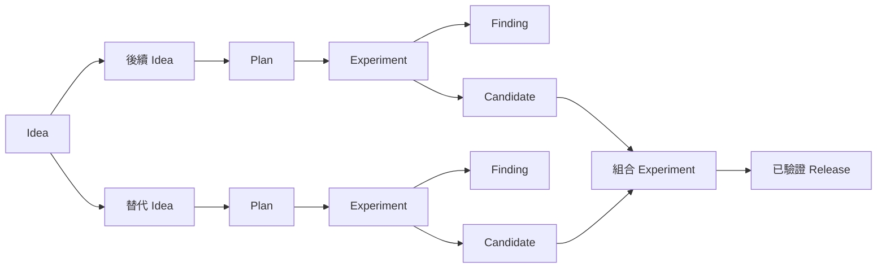

# 架構

!!! note "Terminology rule (zh-TW pages)"
    技術名詞首次出現以「中文 (English original)」格式呈現，例：依賴注入
    (dependency injection)。**不自創翻譯**——若無公認譯名直接保留英文
    （如 `embedding`、`tokenizer`）。代碼、API 名、CLI flag、套件名、檔名一律不翻。

## 產品邊界

`exp` 是 Git 原生研究控制平面 (Git-native research control plane)。它選擇並記錄研究
工作；但不取代執行程式碼、儲存遙測資料 (telemetry) 或提供正式環境產物的系統。

```mermaid
flowchart TB
  subgraph Canonical[以 Git 為後盾的科學權威]
    I[Ideas 與 Plans]
    Q[Pool/lane Queues]
    X[Experiments、Runs、Attempts]
    K[Evaluations、Findings、Decisions]
    R[Candidates、Releases、Promotions]
  end

  subgraph Operational[私有操作狀態]
    D[Daemon 租約與公平性]
    O[Jobs、outbox、fencing tokens]
    T[終止標記 (terminal markers) 與觀察結果]
  end

  subgraph Upstream[上游擁有者]
    G[Git branches 與 worktrees]
    P[Pueue tasks 與 groups]
    M[MLflow runs 與 artifacts]
    S[限定於 Plan 的 Study backend]
  end

  I --> Q --> X --> K --> R
  D --> O --> P
  Q --> D
  G --> X
  P --> T --> X
  M -. 已清理的參照 .-> K
  S -. 已清理的觀察結果 .-> X
```

程序成功是操作事實，而絕不是科學結論。無效證據不等於遭反駁的假設。

## 權威矩陣

| 資訊 | 權威來源 | `exp` 的處理方式 |
|---|---|---|
| 自主性、分類法、queue 公式、lane 配置、promotion gate | 規範性 (canonical) `POLICY.md` | 以 revision 檢查進行變更 |
| 人類/agent 提案與父層 Ideas | 規範性 Idea | 保留來源與資格判定狀態 |
| 預期效用、受限資源、假設 | 規範性 Plan | 僅將資格完整的 Plan 加入 Queue |
| Pool 容量與 Queue 順序 | 規範性 ResourcePool 與 Queue | 從精確的 pool/lane frontier 分派 |
| Listwise 建議與 pairwise 比較 | 規範性 QueueAdvice 與 Battle | 不可變的稽核輸入；絕非隱藏權威 |
| 科學協定與結論 | 規範性 Experiment | 鎖定設計；僅透過明確交易 (transaction) 結案 |
| 預期的證據單位 | 規範性 Run | 與重試/程序叫用分開保存 |
| 已遮蔽的執行身分與操作狀態 | 規範性 Attempt | 根據持久觀察結果明確進行調和 (reconcile) |
| 指標協定與測量結果 | 規範性 EvaluationSpec 與 Evaluation | 不可變且可比較的證據 |
| 信念與改變信念的關係 | 規範性 Finding | 從連入邊推導 weakened/overturned 狀態 |
| 可重複使用的已評估結果 | 規範性 Candidate | 固定 Experiment、Evaluation、Git commit 與 ChangeSet |
| 下游組合 | 規範性 typed Release | 多個 Candidates 必須具備組合證據 |
| 正式環境決策 | append-only Promotion chain | 必須有 sealed holdout 與具名人類核准 |
| 目前的正式環境選擇 | 衍生的 Champion | 只負責呈現；絕不讀回 manifest 作為權威來源 |
| 程式碼歷史與整合 | Git | Agent 可建立精確的 experiment commit；由人類 merge |
| 即時本機 task/group 狀態 | Pueue | 透過 adapter 觀察/調和；絕不複製原始 envs |
| 指標、traces、artifacts、registry | workload 擁有的 MLflow 或其他 provider | 驗證選定欄位；保留已清理的參照 |
| 租約、jobs、outbox、公平性、provider 觀察結果 | 私有 SQLite | 持久的本機協調，絕非科學權威 |
| 單一 Plan 內的搜尋 trials 與 pruning | 設定的 Study backend | provider-neutral adapter 邊界；沒有全域優先權 |
| 產生的 README/roadmap/ledger/decision/champion views | 規範性 records | 僅允許確定性投影 (deterministic projections) |

## 研究有向無環圖

線性證據鏈在更大的有向無環圖 (directed acyclic graph, DAG) 中仍然有效：



正向邊只有一個規範性擁有者。反向邊與彙整樹狀結構都是投影。當某個分支失敗、
被取代，或成為後續組合的輸入時，不會重寫歷史。

Plan v2 中的 Finding 相依性同時固定 Finding revision 與信念摘要 (belief digest)。
該摘要包含連入的 `weakens` 與 `overturns` 邊，因此即使目標 Finding 檔案本身沒有
改變，新的信念變更證據仍會使相依的 Plans 與 Queue entries 過期。

指定的 ResourcePool/lane partition 只能由一個規範性 Queue 擁有。這能讓每個受限的
frontier 維持全域排序，避免 Queue ID 的排序讓另一個 Queue 中價值更高的 Plan 得不到
資源。

## Policy 與自主性

`POLICY.md` 是沒有 ID 的 singleton。其預設值為 `manual`，並採用 80/20 的
exploit/explore 配置。

| 模式 | Frontier 可見性 | 自動分派 Experiment |
|---|---:|---:|
| `manual` | 是 | 否 |
| `shadow` | 是 | 否 |
| `assisted` | 是 | 是，但必須明確確認 |
| `limited` | 是 | 是，但必須明確確認 |

目前的 dispatcher 將 `assisted` 與 `limited` 視為允許分派的 policy modes；下游部署
可利用兩者差異制定額外的審查慣例。切換至任一模式都需要
`--confirm-auto-experiment`。正式環境 Promotion 不屬於此自主性軸線，且一律只能由
人類執行。

Policy 也擁有受控的 `domain`、`work`、`method` 與 `component` 詞彙；以及 lane、
risk、horizon、origin、cluster saturation thresholds、score formula version 與
tie behavior。自由探索用的 labels 則仍保留在 `tags` 中。

## Queue 准入 (admission)

Queue 包含以 `(ResourcePool, lane)` 識別的有序 partitions。一個 Plan 在所有 Queues
中最多出現一次，並固定用於排序的精確正規化 Plan revision。

透明的評分估算如下：

```text
(probability × impact + information gain + unblock value - downside)
--------------------------------------------------------------------- + aging
                         pool-hours
```

排序層支援有界區間 (bounded intervals)；Plan v2 的點估計會以退化區間
(degenerate intervals) 輸入。計算也會使用較小的成本下限與設有上限的 aging bonus。
分數公開可見，但不會賦予 agent 變更權限。

由 agent 支援的插入分為兩個階段：

1. 由一個全新的 agent 對完整 partition 加上 challenger 進行排序 (listwise)；
2. challenger 與相鄰 incumbents 進行兩次 Battle，並對調呈現順序。

兩次判斷都必須一致且高於設定的信心閾值 (confidence threshold)。棄權、意見分歧、
信心不足，或 policy 規定的 tie review，都會記錄 Advice/Battle 稽核資料，但不會改變
Queue。其他穩定的 ties 則維持 incumbent 排在前面。

## 執行控制平面 { #execution-control-plane }

`.exp/runtime.json` (`exp.runtime/v1`) 是嚴格、專案本機且不含祕密的 runtime contract。
它綁定：

- 一個規範性 ResourcePool 至 Pueue group 與 label prefix；
- 一個規範性 Plan 至絕對路徑 executable、精確 argument vector、main 或
  registered-worktree checkout 選擇、repository-relative cwd、timeout、明確允許且不含
  祕密的 environment-variable names、完整 Git base/head commits、ChangeSet 與預期輸出。

daemon 會讀取規範性 frontiers 與該 runtime contract。`frontier` 是本機讀取；`tick` 與
`run` 會聯絡 Pueue。controller 會：

1. 取得帶有 fencing token 的專案租約 (lease)；
2. 建立 Pueue snapshot，並調和已知 Attempts 的操作狀態；
3. 透過穩定的 task label 恢復到期的 outbox submissions，且暫停時不送出；
4. 暫停時，或 policy 為 manual/shadow 時，停止准入；
5. 以加權的 exploit/explore 公平性，使用宣告的 units 填滿已啟用 pool 的容量；
6. 以原子方式建立 Experiment、Run 與 Attempt，啟動 Plan，並移除精確的 Queue frontier；
7. 以原子方式將私有 job 加入 queue、依精確 ID claim 該 job，同時建立其 submission
   outbox entry，接著要求 Pueue 將 worker envelope 加入 queue。

公平性計數器會隨時間朝 Policy shares 靠攏；若只有一個 lane 符合資格，則可借用未使用
的容量。具名 ResourcePools 是不可跨越的硬性容量邊界；Queue score 無法繞過它們。

分派之前，controller 會驗證精確的 Git HEAD、base ancestry、已 commit 的 ChangeSet，
以及乾淨且可執行的 tree。registered-worktree runtime 會選擇位於 `head_commit` 的唯一
linked worktree，而不保存其 host path。私有 worker 會檢查 fencing token、在最小化
環境中執行精確的 workload argv、驗證預期輸出並計算 hash，接著在更新 SQLite 前發布
持久的終止標記 (terminal marker)。Replay 會修復中斷的 SQLite finalize，而不會重複
執行 workload。缺少 marker 或 scheduler 狀態不明確時，狀態為 `unknown`，不能據此
證明重試安全。

daemon 可以調和 Attempt 的操作狀態。它絕不會結束 Experiment、選擇 evidence
disposition、寫入 Finding、評估 Candidate、組成 Release，或核准 Promotion。

## Git 工作區邊界

Experiment 的程式碼變更使用由 XDG 管理的 linked worktree，以及名為
`exp/<short-id>-<slug>` 的 branch。準備作業需要乾淨的來源 checkout 與精確、完整的
base commit。Commit 會根據明確的 allowlist globs 驗證每個變更路徑，排除
`experiments/` 與 Git metadata，只 stage 那些精確路徑，並建立一個以指定 base 為
parent 的 commit。

回傳的 ChangeSet 包含 base、head、branch、精確路徑與 binary diff digest。`exp` 絕不
merge 該 branch、移除 worktree，或變更由人類擁有的 integration branch。

## Evaluation、Release 與 Promotion

EvaluationSpec 定義 dataset/split identity、protocol、metric directions 與 thresholds、
ResourcePool budget，以及用途（`scientific` 或 `promotion`）。Evaluation 是針對
Experiment、Candidate 或 Release 的不可變測量結果。只有已清理的外部參照，才能附加
workload 所擁有的 MLflow identity。

Candidate 只有在來源為受支援且已結束的 Experiment、通過的 scientific Evaluation，
以及 included Run 的成功 direct Attempt，且該 Attempt 符合 Candidate 的 Git identity
與 ChangeSet 時，才符合資格。Release 使用 Candidates 填入特定 target 的具名 slots。
Slot names 是專案慣例，而不只是 model-specific types：量化工作可以組合 `signal`、
`risk`、`portfolio` 與 `execution`；其他專案則可使用 `main` 或特定領域名稱。

使用超過一個 Candidate 時，必須有經過評估的組合 Experiment，因為不會假設各自獨立的
收益可相加。已驗證的 Release 只有透過 sealed、用於 promotion 的 EvaluationSpec、
有界的 holdout，以及由具名人類 approver 核准的 append-only Promotion，才能挑戰
incumbent。每個 target 的 Champion 都會獨立衍生。

## 儲存邊界

規範性 records 位於固定的 `<git-root>/experiments` root。front matter 中的 IDs 是身分；
paths 則用於導覽。

```text
experiments/
├── PROJECT.md
├── POLICY.md
├── README.md, ROADMAP.md, LEDGER.md, DECISIONS.md
├── ideas/, plans/, resource-pools/, queues/, queue-advice/, battles/
├── evaluation-specs/, evaluations/, findings/, decisions/
├── candidates/, releases/, promotion-specs/, promotions/
└── e-<short-id>-<slug>/
    ├── REPORT.md
    ├── runs/
    └── attempts/
```

所有 linked worktrees 都透過 Git common directory 協調：

```text
<git-common-dir>/exp/
├── v1/
│   ├── lock
│   ├── project-receipt.json
│   ├── reservations/
│   ├── transactions/
│   └── attempts/
└── runtime/v1/control.sqlite
```

協調 tree 與 SQLite database 都是私有本機狀態。它們不受 Git 追蹤，也無法建立科學真相。

## 交易與恢復

複合規範性變更使用 `exp.transaction/v1` prepared journals。在 common lock 保護下，
`exp` 會驗證完整的 candidate inventory、保留新 IDs、寫入並 fsync 精確的 staged bytes，
然後在第一次規範性變更前發布 journal。發布會依 path 以確定性順序進行。

恢復會根據精確的 old/new hashes 向前推進。destination 已是新 hash 時會接受；仍為舊
hash 時會推進；任何第三種值都會停止，且不覆寫無關的編輯。變更操作會先恢復 prepared
journals，再建立新的 candidate state；`exp record recover` 則提供明確的恢復操作。
投影只會在規範性 commit 之後重新產生。請參閱 [transactions.md](transactions.md)。

## Provider 與搜尋邊界

Pueue 與 MLflow 是已實作的外部 adapters。Pueue snapshots 會在資料跨越 adapter 邊界前，
遞迴移除已擷取的 environment maps。Submission 僅接受已稽核的私有 worker envelope。
明確取消需要確認。MLflow verification 是唯讀的，只會從 workload 建立的 run 回傳指定的
metrics/tags。

provider-neutral Study contract 是作為整合邊界實作，而非具體的 Optuna runtime。Search
保持在單一且精確的 Plan revision 內；它不能擁有 queue ordering、scheduling、Findings、
Releases 或 Promotions。請參閱 [provider-contract.md](provider-contract.md) 與
[search-adapter-contract.md](search-adapter-contract.md)。

## 非目標

目前的實作不會：

- 取代 Pueue、MLflow、artifact store、registry 或 notebook runtime；
- 從 process/scheduler/tracker 狀態推斷科學結論；
- merge experiment branches 或部署 Champion；
- 允許 agent 或 autonomy mode 核准正式環境 Promotion；
- 實作具體的 Optuna adapter、安裝 Python packages，或啟動 search service；
- 保存原始 environments、無界限 logs、secrets 或 artifact bytes；
- 提供多個 experiment roots、跨 repository graph，或動態 Go plugin ABI；
- 在 migration 期間執行 legacy harness scripts。
