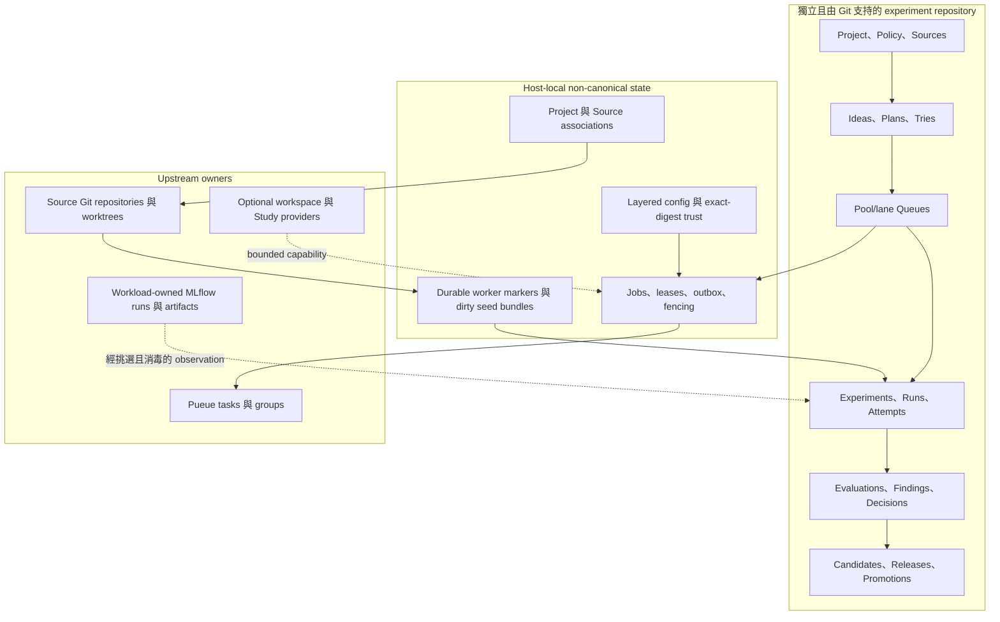
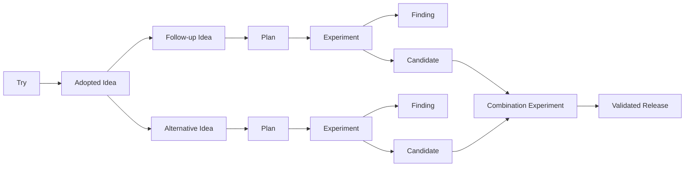

# 架構

!!! note "Terminology rule (zh-TW pages)"
    技術名詞首次出現以「中文 (English original)」格式呈現。若無公認譯名，
    直接保留 English original。程式碼、API 名、CLI flag、套件名與檔名一律不翻。

## 產品邊界

`exp` 是 Git 原生研究控制平面 (Git-native research control plane)。它負責選擇、
記錄、派送與保存研究工作；但不取代 Git、scheduler、telemetry system、artifact
store 或 production deployment system。

Project 的 canonical records 不必與受研究的 code 位於同一個 Git repository。
Canonical **experiment repository** 是包含 `experiments/PROJECT.md` 的一般 Git
repository。每筆 canonical `Source` record 定義 Project-local Git source identity；
private host-local association 再把該 identity 對應到 checkout。`Try` 是有界的探索工作；
正式 `Experiment`／`Run` execution 才是能進入 promotion 的路徑。



Process success 是 operational fact，絕不是 scientific verdict。Invalid evidence
不等於 refuted hypothesis。Provider artifact URI 是 observation，不是 canonical
content 或 deployment authority。

## 權威矩陣

| 資訊 | Authority | `exp` 的處理方式 |
|---|---|---|
| Project identity 與 canonical research graph | 所選 experiment repository 中的 `PROJECT.md` 與 typed records | 先解析唯一 Project；驗證 exact schema/revision，並在其 Git-common lock 下 mutation。 |
| Source identity、不可變 semantic subdirectory、lifecycle 與 sanitized locator hints | canonical `Source` | 保持 path-free 與 host-independent。Source 是一般 record，不是第二個 root 或 repository mount。 |
| Local Project/Source checkout mapping | `$XDG_STATE_HOME/exp/associations/v1.json` | 每次使用都驗證 Project UUID、Source ID、Git-common path/filesystem identity、subdir 與 locator intersection；此檔案不能建立 canonical identity。 |
| Config selection 與 execution-bearing preference | layered `exp.config/v1` files 加上 `$XDG_STATE_HOME/exp/trust/v1.json` | 只在 authority 確定後解析；保留每個 leaf 的 provenance；要求 exact file digest、capability、Project/Source scope 與 Git-common filesystem identity。 |
| Autonomy、taxonomy、Queue formula、lane allocation、promotion gate | canonical `POLICY.md` | 以 revision check mutation。 |
| Proposal、exploratory question 與 formal qualification | canonical Idea、Try 與 Plan | 將 Try 與 formal evidence 分離；已 concluded Try 只有經具名人類確認，才能 atomically adopt 成 Idea v2。 |
| Pool capacity 與 Queue order | canonical ResourcePool 與 Queue | 從精確 pool/lane frontier dispatch。 |
| Listwise advice 與 pairwise comparison | canonical QueueAdvice 與 Battle | 不可變 audit input；絕不是隱藏 mutation authority。 |
| Scientific protocol 與 conclusion | canonical Experiment | Attempt 前先 lock design；只能透過 explicit transaction closure。 |
| Intended evidence unit | canonical Run | 與 retry/process invocation 分開。 |
| Redacted execution identity 與 state | canonical Attempt | V3 恰好擁有一個 Run 或 Try，並攜帶 SourceSnapshots；terminal observation 必須明確匯入。 |
| Metric protocol 與 measured result | canonical EvaluationSpec 與 Evaluation | Evaluation v2 把 formal evidence 綁到一個精確 successful Attempt。 |
| Belief 與 belief-changing relation | canonical Finding | 從 incoming edge 推導 weakened/overturned state。 |
| Reusable evaluated result | canonical Candidate | Candidate v2 從 formal Attempt 複製 clean Source identities，並要求綁到同一 Attempt 的 Evaluation v2。 |
| Downstream composition 與 production decision | Release 與 append-only Promotion chain | 要求 combination evidence、sealed holdout 與具名 human approval。 |
| 目前 production selection | derived Champion | Render manifest；絕不讀回作為 authority。 |
| Commit、branch、worktree 與 integration | native Git | 固定 full object ID 與 exact changed path。`exp` 絕不自動 merge 或 push。 |
| Live task/group state | Pueue | 透過 bounded adapter observe/reconcile；絕不複製 raw environment。 |
| Run、metric、trace、artifact 與 registry state | workload-owned MLflow 或其他 provider | 只讀 selected field，且只保留 verified sanitized reference；artifact bytes 位於 `exp` 外。 |
| Lease、job、outbox、fairness、provider observation | private SQLite | 協調 local execution；不能建立 scientific meaning。 |
| Generated page、manifest 與 TUI row | canonical records 加 bounded local observations | 一律視為 read-only projection。TUI 沒有 mutation、login、install、service-start、editor 或 handoff key。 |

## 建議的 repository arrangement { #recommended-repository-arrangement }

預設建議使用**專用 private experiment repository**。它讓 canonical research
history、trust review 與 access policy 不依附任何單一 code repository，同一 Project
仍可宣告多個 Sources。Interactive `exp init` 會先提供此 layout；non-interactive
專用設定使用 `--dedicated-repo`、`--source-repo`、`--source-key` 與 `--confirm`。
Initialization 可以採用精確 Git root；若明確加上 `--create`，也能初始化經審閱的 missing／
empty target。它不會建立 remote、commit、submodule 或 push。Dedicated repository 與
initial Source 必須有不同 Git-common identity。

Git submodule 只是一種 optional checkout convenience。它可以讓 experiment repository
與 code checkout 同時出現在一個 parent tree，但 submodule placement 不是 Source
identity、association state 或 execution authority。仍必須使用一般 Source record 與經驗證的
local association。

當 code 與 research 共用治理時，monorepo 或 embedded `experiments/` directory 仍受支援，
也保留既有 v1 Project 的 backward compatibility。每筆 Source 的不可變 `subdir` 選擇其
Git repository 內的 semantic root；`.` 代表 repository root。多筆 Source records 可以代表
多個 repositories 或多個受治理的 subdirectories；每個 Try 或 formal runtime 都明確宣告
所用 Source set。

每個 canonical Project 仍只有一個可探索 root：
`<experiment-git-root>/experiments/PROJECT.md`。「獨立」表示此 Git repository 可以不同於
Source repositories，不表示 Project v1 會搜尋任意 marker path。

## Research DAG 與 Policy

線性 evidence chain 仍可存在於較大的有向無環圖 (DAG) 中：



Forward edge 只有一個 canonical owner；reverse edge 與 consolidated tree 都是 projection。
某分支失敗或被 supersede 時不重寫 history。Plan v2 dependency 同時固定 Finding revision
與 belief digest；digest 也涵蓋 incoming `weakens`／`overturns` edges。因此即使 referenced
Finding 沒有被編輯，新的 belief-changing evidence 仍可使 Plan 與 Queue entry stale。

`POLICY.md` 預設 `manual`，exploit/explore share 為 80/20。`manual` 與 `shadow`
顯示 frontier 但不 admission；`assisted` 與 `limited` 只有在明確 policy confirmation 後才
允許 dispatch，目前 dispatcher 除此之外不區分兩者。Production Promotion 不在此 autonomy
axis 內，永遠只能由人類執行。

Queue 擁有有序 `(ResourcePool, lane)` partitions。指定 partition 只能由一個 Queue 擁有，
一個 Plan 在 Project 內最多出現一次。Ranking 結合 expected utility、information gain、
unblock value、risk、pool-hours 與 bounded aging。Agent listwise advice 與交換順序的
adjacent battles 都會被記錄；abstention、disagreement、low confidence 或 policy tie 都維持
incumbent order。

## Execution paths

### Direct Try

`exp try run` 解析一個 active Source、capture 其精確目前狀態，並在建立 job 或 worktree
之前先發布 Try 與 planned Attempt v3。它直接傳遞 argv，絕不傳 shell string。除非 `--allow`
globs 授權 Source-subdir-relative changes，managed workspace 預設為 read-only。

Clean mode 會拒絕任何 tracked、untracked 或 submodule dirt。Dirty work 絕不 implicit：
`--dirty=capture` 僅供 Try 使用，會記錄 bounded SourceSnapshot，並在 XDG cache 建立 private
authenticated seed bundle。Capture 會拒絕 Source subdir 外的 path、ambiguous rename/copy、
unsupported index flag、dirty 或 nested submodule、symlink/non-regular node，以及超過 hard
size/count limit 的內容。Execution 前與 destructive cleanup 前，managed worktree 都必須能
精確 round-trip 至該 seed。

Direct job 透過 private operational store 在本機執行，不經 Pueue。Lease heartbeat 與 durable
worker-terminal marker 讓 resume 採保守策略：`resume` 只重用可證明尚未啟動的 Attempt，或
匯入 verified marker；絕不重新執行 uncertain execution。`retry` 只有在最新 Attempt 已
terminal 後才建立一筆新 Attempt v3，並透過 `retry_of` 保留 Source state、cwd、argv 與
execution Source。沒有 terminal evidence 的 unknown Attempt 必須 explicit reconcile 才能
abandon。

Try 只有在所有 owned Attempts 均 terminal 後才能 conclude 或 abandon；selected result
digests 必須屬於那些 Attempts。Adoption 會在同一 transaction 中建立 Idea v2 並更新
reciprocal Try state。Clean 或 dirty Try evidence 都不能直接支持 Candidate；有價值的 dirty
Try 必須經 clean formal path 重跑。

### Formal runtime v1 與 v2

`.exp/runtime.json` 仍是 strict、non-secret、project-local execution contract，具有兩個
彼此分離的 closed decoders：

- `exp.runtime/v1` 是 embedded-repository compatibility contract。它把 Plan 綁到單一
  repository 的 `main` 或 `registered_worktree`、top-level Git base/head/ChangeSet、
  executable、argv、cwd、environment-name allowlist 與 expected outputs；產生 Attempt v2。
- `exp.runtime/v2` 支援 Source。它指定一個 writable `execution_source` 與零個以上
  `read_only_sources`；每個 Source 都指定 `main`、`registered_worktree` 或
  `managed_worktree` checkout、full base/head IDs、exact ChangeSet，以及適用時明確的
  no-change observation。Cwd 與 expected outputs 相對 execution Source canonical subdir；
  ChangeSet 仍相對 Git root。它產生 Attempt v3。

Runtime v2 dispatch 要求 raw runtime-file digest 的 exact `runtime.dispatch` trust receipt。
它透過 local association 解析每筆 canonical Source、載入 execution Source layered config、
只 capture clean SourceSnapshots，並可準備 deterministic managed worktrees。Missing、stale、
dirty、mismatched 或 untrusted Source 會在 scheduler submission 前 block；recovered outbox
也會重新驗證，不能樂觀提交時改成 `blocked`。

Controller 先 atomically 建立 Experiment、Run 與 Attempt、啟動 Plan，並移除精確 Queue
frontier，之後才建立 private job/outbox，再向 Pueue 提交 argv-only worker command。
Runtime v2 會把 explicit `--canonical-root`、`--project` 與 checkout-local `--scope` 傳給
hidden worker。Worker 先重新探索 exact Project、驗證 scope 與 metadata-only job
authority/fencing，之後才讀 payload。V2 payload 綁定 Project、canonical scope、execution
Source、所有 private checkout paths 與 canonical snapshot digests；non-execution Sources
必須為 read-only，並在 process 成功後再次驗證。

Worker 使用 minimal environment、hash declared outputs、freeze bounded result JSON，並在
SQLite completion 前 durable publish terminal marker。有效 final marker，或 recoverable
`.tmp` marker 搭配 matching frozen result，可以修復中斷的 SQLite state，而不會重跑 workload。
Missing marker、expired lease 或 ambiguous scheduler observation 都不能證明 retry 安全。
Daemon 可 reconcile Attempt operational state；絕不 closure Experiment、選 evidence、寫
Finding、建立 Evaluation/Candidate 或核准 Promotion。

## Git workspace 與 provider boundary

Native Git 是 byte 與 lifecycle authority。Identity-aware branch 與 XDG worktree path 包含完整
Project、Source 與 owner IDs。Preparation 固定 exact full commit、重新驗證 Source Git-common
identity、把 worktree 放在所有 registered checkout 外，並拒絕 canonical metadata 與 allowlist
外的 paths。Formal agent commit creation 只允許 Experiment owner；它只 stage 實際觀察到且
允許的 paths，並建立 single-parent commit。

Native inspection 一律驗證 repository、branch、ancestry、path、metadata 與 allowlist state。
一般 cleanup 只移除仍在 base 的 clean worktree。Dirty Try cleanup 只有在兩次 exact private-seed
verification 後，才可使用 Git force removal。Cleanup 會移除 worktree 與 private seed，但刻意保留
branch、commit、operation row 與 terminal marker。Preparation marker 只允許清除經驗證且未完成的
prepare。

Workspace registry 公開 `native_git` 與 optional `dev_cli`。目前 `dev_cli` release 沒有
schema-versioned exact-path machine lifecycle receipt，因此 prepare、inspect、cleanup、open、
handoff 與 retire 全部 fail closed 為 unsupported。Trusted selection 可在 policy 明確允許時
fallback 至 `native_git`。不論 requested provider 為何，verification、inspection 與 cleanup
都由 native Git 擁有；provider-local catalog/task ID 絕不是 canonical。

## Evaluation、artifact 與 Promotion

EvaluationSpec 定義 comparable dataset/protocol、metrics、thresholds、budget 與 purpose。
Evaluation v2 只適用 Experiment subject，且要求一個 successful terminal formal Attempt v3；
其 Run 必須屬於該 Experiment。Candidate v2 要求 Evaluation 綁定同一 Attempt、Experiment
conclusion 納入該 Attempt 的 Run、所有 snapshots 都是 clean，並複製每個 Source ID、head
commit 與 exact ChangeSet。Candidate v1 保持 closed legacy path，且必須由 matching
successful Attempt v2 支持。

MLflow profile 只包含 binary name、non-secret context、timeout、environment **names 與
policy**，以及 default metric names。Workload 擁有 run creation 與 logging；`exp` 只執行
bounded read-only describe。Provider 缺少或 optional worker observation 未 verified，不會把
successful workload 改成 failure。只有 exact verified Attempt ownership 才能成為 ExternalRef。
Artifact URI 只是 sanitized identity hint；artifact bytes 不會下載進 canonical records，也不是
promotion authority。

Release 用 Candidates 填入 typed slots。多個 distinct Candidates 需要 supported combination
Experiment 與 Evaluation。Promotion 使用另行 sealed 的 promotion-purpose EvaluationSpec、
fresh finite holdout、append-only chain 與具名 human approval。目前 Champion 與
`exp.champion-manifest/v1` 或 Source-aware v3 output 都只是 derived view。

## Storage 與 recovery boundary

Canonical records 位於所選 experiment repository：

```text
experiments/
├── PROJECT.md, POLICY.md
├── sources/, ideas/, plans/, resource-pools/, queues/
├── queue-advice/, battles/, evaluations/, findings/, decisions/
├── candidates/, releases/, promotion-specs/, promotions/
├── t-<full-try-uuid>-<slug>/
│   ├── TRY.md
│   └── attempts/
└── e-<prefix>-<slug>/
    ├── REPORT.md
    ├── runs/
    └── attempts/
```

該 experiment clone 的所有 linked worktrees 都透過其 Git common directory 協調。新的 compound
write 使用 worktree-scoped `<git-common-dir>/exp/v1/transactions-v2/` journal，schema 為
`exp.transaction/v2`；舊 `transactions/` namespace 依 strict compatibility rule 維持可讀。
V2 包含 path-free worktree identity，因此 prepared journal 只由 owning worktree recovery。
Exact old/new byte hash 使 recovery 只能 roll forward，遇到第三種 value 就停止。Canonical
commit 後才重新產生 projections。

其他 local state 包含：

```text
$XDG_STATE_HOME/exp/associations/v1.json
$XDG_STATE_HOME/exp/trust/v1.json
$XDG_CACHE_HOME/exp/source-seeds/
$XDG_DATA_HOME/exp/worktrees/
<experiment-git-common-dir>/exp/runtime/v1/control.sqlite
<experiment-git-common-dir>/exp/v1/attempts/
```

以上都不是 Git-backed scientific authority。請參閱
[Storage and transactions](transactions.md)與
[Configuration and paths](../reference/configuration.md)。

## Read-only TUI

`exp ui` 由 immutable sanitized snapshot 呈現 Workflow、Workspace、Tries、Queue、Attempts、
Candidates 與 Readiness tabs。Startup 只讀 canonical records、associations、config provenance，
並以 read-only mode 開啟既有 operation database；不會建立 database。只有明確進入或 refresh
Readiness tab 才會 probe，且只執行 bounded local probe，不會 install、login、start service、
執行 workload 或寫 canonical record。Generation/identity fence 會丟棄 stale asynchronous
response。Machine caller 應使用一般 `--json` commands；`exp ui` 本身要求 terminal stdin/stdout，
沒有 JSON mode。

## 非目標與目前限制

目前實作不會：

- 自動 merge、push、deploy 或 rollback Git branch／Champion；
- 從 process、scheduler、MLflow 或 artifact state 推論 scientific validity；
- 讓 agent、autonomy mode、TUI 或 provider 核准 Promotion；
- 在沒有 exact schema-versioned machine receipt 時使用 `dev_cli` lifecycle operation；
  native Git 仍是 prepare/inspect/cleanup authority；
- 提供 large-artifact store、mirror raw telemetry/log，或保存 artifact bytes/raw environment；
- 直接 promotion dirty Try；必須 clean formal rerun 並建立 typed Evaluation；
- 在同一 Git repository 探索多個 canonical Project roots，或在不同 Project UUID 間建立
  canonical relationship；
- 提供 concrete Optuna runtime、universal cloud scheduler/registry 或 dynamic Go plugin ABI；
- 在 migration 中執行 legacy harness scripts。
