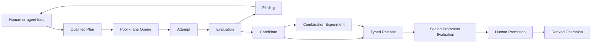

# Autonomous research control plane

## Closed loop

The control plane extends the linear v1 evidence model into a durable research
DAG while keeping canonical Markdown as the only scientific authority.



Idea, Experiment, and Candidate parent edges allow branches to be followed,
merged, or abandoned without rewriting history. Reverse edges and consolidated
views are projections; each canonical relation still has exactly one owner.

## Canonical records

`POLICY.md` is a special ID-less singleton. It stores the autonomy level,
exploit/explore shares, queue formula version, tie behavior, controlled
classification vocabulary, cluster saturation thresholds, and the mandatory
human promotion gate.

Policy is created in `manual` mode. `manual` and `shadow` expose the canonical
frontier without granting dispatch authority. `assisted` and `limited` enable
experiment dispatch only after the caller supplies the explicit
`--confirm-auto-experiment` acknowledgement. Promotion is a separate authority
boundary and remains human-only in every mode.

The remaining additions use typed UUIDv7 IDs:

| Record | Authority |
|---|---|
| Idea | Human/agent proposal, qualification state, origin, cluster, and parent ideas |
| ResourcePool | A bounded bottleneck, capacity, unit, and optional cost |
| Queue | Ordered Plan entries partitioned by ResourcePool and exploit/explore lane |
| QueueAdvice | Immutable listwise ranking suggestion against one Queue revision |
| Battle | Immutable order-swapped pairwise comparison and confidence |
| EvaluationSpec | Metrics, direction, protocol, resource budget, and optional seal |
| Evaluation | Immutable measured outcome for an Experiment, Candidate, or Release |
| Candidate | Evaluated Experiment result, Git identity, ChangeSet, and parent candidates |
| Release | Target plus typed slots filled by Candidates |
| PromotionSpec | Sealed holdout protocol and mandatory human approval policy |
| Promotion | Append-only challenger/incumbent decision linked to the previous Promotion |

Free discovery labels remain in `tags`. Queue policy uses the controlled
`domain`, `work`, `method`, `component`, `lane`, `risk`, `horizon`, and `origin`
classification fields plus one primary cluster.

## Queue authority and stale work

A Queue partition is identified by `(resource_pool, lane)`. Entry order is
semantic, a Plan may occur only once across the Queue, and every entry pins the
normalized Plan revision used during ranking. Queue mutation increments its
positive revision; Advice and Battle records retain the revision they observed.

Plan v2 dependencies pin both the Finding record revision and a belief digest.
The belief digest covers the target revision and all incoming
`weakens`/`overturns` edges, including the source Finding revisions. Adding or
changing belief-changing evidence therefore makes dependent Plans and queue
entries stale even when the target Finding file itself did not change. Stale
Plans are invalid inventory and cannot be dispatched.

Refreshing stale work is not a blind acknowledgement: the caller supplies a
complete new utility estimate, the transaction repins beliefs, removes the Plan
from its Queue, and returns its Idea to qualified state. A later Queue insertion
must score and battle it again. Started/completed Plans retain their historical
pins and are not made stale by evidence discovered after execution.

Queue Advice is listwise and provisional. An insertion can then compare the
candidate with adjacent incumbents twice, swapping presentation order. An
abstention, low-confidence response, order disagreement, or policy-required tie
must resolve to human review; Advice and Battle audits are preserved but Queue
order stays unchanged. Stable ties otherwise keep the incumbent first.

The transparent provisional score combines expected utility, information gain,
unblock value, downside, constrained pool-hours, and a bounded aging bonus.
Named ResourcePools are hard capacity boundaries. The daemon targets the
Policy's default 80/20 exploit/explore shares over time and borrows idle
capacity when only one lane has eligible work.
One autonomous Plan uses exactly one ResourcePool need; coupled resources are
represented as a composite pool until atomic multi-pool admission exists.

## Execution and evaluation

Experiment v2 adds replication, sweep, and combination designs, multi-parent
lineage, and explicit Candidate inputs for combination experiments. Attempt v2
adds the ResourcePool, Queue revision, lane, dispatch identity, base/head Git
commits, and exact ChangeSet. V1 Plan, Experiment, and Attempt files continue to
use their exact closed decoders; a v1 schema claiming any v2-only field is
rejected.

`.exp/runtime.json` binds canonical Pool and Plan identities to a Pueue group,
stable label namespace, exact workload argv, environment-variable names, and
full Git base/head/ChangeSet. It is operational configuration, not a canonical
record. Pool label prefixes are prefix-free within each Pueue group, and the
selected config path is excluded from experiment ChangeSets. Git verification
covers queued work and active prepared Attempts rather than obsolete terminal
Plan entries. The daemon uses a private SQLite lease, fencing tokens, jobs, fairness
counters, and an outbox; Pueue remains authoritative for live task state. A
worker freezes a bounded result and publishes its terminal marker before
updating SQLite so replay can return the durable result without re-executing
the workload. Dispatch IDs, labels, outbox recovery, and marker names include a
canonical-worktree scope even though SQLite is shared through Git-common.

Code-editing agents use a dedicated linked worktree at an exact base. `exp`
commits only the observed allowlisted paths and returns the base/head and diff
digest. It never merges the experiment branch, removes the worktree, or grants
the agent integration authority. That commit is preparation, not evidence; a
Candidate still requires a successful direct Attempt for an included Run with
the identical head and ChangeSet.

Optuna or another search backend may own ask/tell trials and pruning inside one
Plan. It does not own the global Idea queue, cross-Plan resource allocation,
Findings, Releases, or Promotions.

Scientific mutations spanning several records use a prepared transaction. The
complete candidate inventory and exact bytes are made durable before the first
canonical rename; restart recovery rolls forward by old/new hashes and refuses
to overwrite an unrelated edit.

## Releases and champions

Release slots are named and typed by project convention (`main` for a monolith,
or for example `signal`, `risk`, `portfolio`, and `execution`). Combining more
than one Candidate requires a separately evaluated supported combination
Experiment and stores its passing scientific Evaluation separately from the
Release-scoped production Evaluation. The control plane never assumes
independently measured gains are additive.

Promotion uses a sealed promotion-purpose EvaluationSpec and a finite holdout
budget. Promotion records form one append-only chain per target. Accepted and
rollback entries require a passed fresh holdout and a human approver; rollback
can restore only the incumbent displaced by the current champion-setting
entry. The current Champion is derived from that chain and can be rendered for
downstream use; a generated manifest is not read back as authority.

## Canonical layout

New typed records use flat reserved directories under `experiments/`:

```text
POLICY.md
ideas/
resource-pools/
queues/
queue-advice/
battles/
evaluation-specs/
evaluations/
candidates/
releases/
promotion-specs/
promotions/
```

The existing Plan, Experiment, Run, Attempt, Finding, and Decision paths remain
unchanged.
