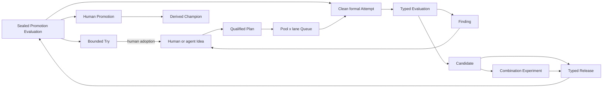

# Autonomous research control plane

## Closed loop

The control plane extends the linear v1 evidence model into a durable research
DAG while keeping canonical Markdown as the only scientific authority.



Idea, Experiment, and Candidate parent edges allow branches to be followed,
merged, or abandoned without rewriting history. Reverse edges and consolidated
views are projections; each canonical relation still has exactly one owner.

## Canonical records

`POLICY.md` is a special ID-less singleton. It stores the autonomy level,
exploit/explore shares, queue formula version, tie behavior, controlled
classification vocabulary, cluster saturation thresholds, and the mandatory
human promotion gate.

Policy is created in `manual` mode. `manual` and `shadow` expose the canonical
frontier without granting dispatch authority. `assisted` and `limited` enable
experiment dispatch only after the caller supplies the explicit
`--confirm-auto-experiment` acknowledgement. Promotion is a separate authority
boundary and remains human-only in every mode.

The additions use typed UUIDv7 IDs:

| Record | Authority |
|---|---|
| Source | Project-local Git identity, immutable subdir, sanitized locators, lifecycle |
| Try | Bounded goal, declared Sources, human conclusion/abandonment/adoption |
| Idea | Human/agent proposal, qualification state, origin, cluster, and parent Ideas; v2 can own `origin_try` |
| ResourcePool | A bounded bottleneck, capacity, unit, and optional cost |
| Queue | Ordered Plan entries partitioned by ResourcePool and exploit/explore lane |
| QueueAdvice | Immutable listwise ranking suggestion against one Queue revision |
| Battle | Immutable order-swapped pairwise comparison and confidence |
| EvaluationSpec | Metrics, direction, protocol, resource budget, and optional seal |
| Evaluation | Immutable measured outcome; v2 additionally owns one formal Attempt for an Experiment subject |
| Candidate | Evaluated Experiment result and parents; v2 pins clean formal Attempt and Source commits/paths |
| Release | Target plus typed slots filled by Candidates |
| PromotionSpec | Sealed holdout protocol and mandatory human approval policy |
| Promotion | Append-only challenger/incumbent decision linked to the previous Promotion |

Free discovery labels remain in `tags`. Queue policy uses the controlled
`domain`, `work`, `method`, `component`, `lane`, `risk`, `horizon`, and `origin`
classification fields plus one primary cluster.

## Queue authority and stale work

A Queue partition is identified by `(resource_pool, lane)`. Entry order is
semantic, a Plan may occur only once across the Queue, and every entry pins the
normalized Plan revision used during ranking. Queue mutation increments its
positive revision; Advice and Battle records retain the revision they observed.

Plan v2 dependencies pin both the Finding record revision and a belief digest.
The belief digest covers the target revision and all incoming
`weakens`/`overturns` edges, including the source Finding revisions. Adding or
changing belief-changing evidence therefore makes dependent Plans and queue
entries stale even when the target Finding file itself did not change. Stale
Plans are invalid inventory and cannot be dispatched.

Refreshing stale work is not a blind acknowledgement: the caller supplies a
complete new utility estimate, the transaction repins beliefs, removes the Plan
from its Queue, and returns its Idea to qualified state. A later Queue insertion
must score and battle it again. Started/completed Plans retain their historical
pins and are not made stale by evidence discovered after execution.

Queue Advice is listwise and provisional. An insertion can then compare the
candidate with adjacent incumbents twice, swapping presentation order. An
abstention, low-confidence response, order disagreement, or policy-required tie
must resolve to human review; Advice and Battle audits are preserved but Queue
order stays unchanged. Stable ties otherwise keep the incumbent first.

The transparent provisional score combines expected utility, information gain,
unblock value, downside, constrained pool-hours, and a bounded aging bonus.
Named ResourcePools are hard capacity boundaries. The daemon targets the
Policy's default 80/20 exploit/explore shares over time and borrows idle
capacity when only one lane has eligible work.
One autonomous Plan uses exactly one ResourcePool need; coupled resources are
represented as a composite pool until atomic multi-pool admission exists.

## Execution and evaluation

Experiment v2 adds replication, sweep, combination designs, multi-parent
lineage, and explicit Candidate inputs. Attempt v2 is the closed legacy formal
dispatch shape with Pool/Queue/lane/dispatch identity and top-level Git
base/head/ChangeSet. Attempt v3 instead owns exactly one Run or Try and carries
an execution Source plus sorted SourceSnapshots; formal dispatch fields are
all-present or all-absent, and only Try-owned v3 may be dirty or use `retry_of`.
Every older schema remains an exact closed decoder.

`.exp/runtime.json` is operational configuration, not a canonical record.
Runtime v1 retains the embedded Pool/Plan/Pueue and Git contract. Runtime v2
requires exact `runtime.dispatch` trust, resolves canonical Sources through
host-local associations, binds one writable and optional read-only Sources to
explicit checkouts, and captures only clean SourceSnapshots. Pool label prefixes
remain prefix-free, environment arrays contain names only, and Pueue secret
environment arrays remain empty.

The daemon uses private SQLite leases, fencing, jobs, fairness, and outbox while
Pueue owns live tasks. Worker-job v2 is invoked with explicit canonical root,
Project UUID, and checkout-local scope; the worker verifies metadata authority
before payload, then verifies private checkout/snapshot identity. It freezes a
bounded result and publishes a durable v2 terminal marker before SQLite, so a
valid marker (including a recoverable temporary plus exact frozen result) can be
replayed without executing twice. Missing evidence remains unknown/blocked.

Code-editing agents use a Source-aware linked worktree at an exact clean base.
`exp` commits only observed allowlisted paths and never merges/pushes or grants
integration authority. A dirty Try may use a private bounded seed and native
verified cleanup, but cannot back a Candidate. Candidate v2 requires a successful
clean formal Attempt v3 for an included Run, Evaluation v2 bound to the same
Attempt, and Source IDs/head commits/ChangeSets copied exactly from its snapshots.

Optuna or another search backend may own ask/tell trials and pruning inside one
Plan. It does not own the global Idea queue, cross-Plan resource allocation,
Findings, Releases, or Promotions.

Scientific mutations spanning several records use a prepared transaction. The
complete candidate inventory and exact bytes are made durable before the first
canonical rename; restart recovery rolls forward by old/new hashes and refuses
to overwrite an unrelated edit.

## Releases and champions

Release slots are named and typed by project convention (`main` for a monolith,
or for example `signal`, `risk`, `portfolio`, and `execution`). Combining more
than one Candidate requires a separately evaluated supported combination
Experiment and stores its passing scientific Evaluation separately from the
Release-scoped production Evaluation. The control plane never assumes
independently measured gains are additive.

Promotion uses a sealed promotion-purpose EvaluationSpec and a finite holdout
budget. Promotion records form one append-only chain per target. Accepted and
rollback entries require a passed fresh holdout and a human approver; rollback
can restore only the incumbent displaced by the current champion-setting
entry. The current Champion is derived from that chain and can be rendered for
downstream use; a generated manifest is not read back as authority.

## Canonical layout

New typed records use flat reserved directories under `experiments/`:

```text
POLICY.md
sources/
ideas/
resource-pools/
queues/
queue-advice/
battles/
evaluation-specs/
evaluations/
candidates/
releases/
promotion-specs/
promotions/
```

Try records use `t-<full-uuid-hex>-<slug>/TRY.md` with owned Attempts below
`attempts/`. Existing Plan, Experiment, Run, Attempt, Finding, and Decision paths
remain unchanged. Source recognition reserves only exact canonical filenames, so
unrelated legacy `sources` content is not reinterpreted.
