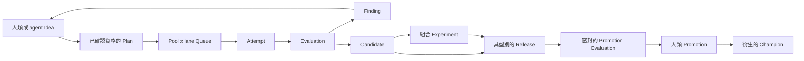

# 自主研究控制平面

!!! note "Terminology rule (zh-TW pages)"
    技術名詞首次出現以「中文 (English original)」格式呈現，例：依賴注入
    (dependency injection)。**不自創翻譯**——若無公認譯名直接保留英文
    （如 `embedding`、`tokenizer`）。代碼、API 名、CLI flag、套件名、檔名一律不翻。

## 閉環

控制平面 (control plane) 將線性的 v1 證據模型擴展為持久的研究有向無環圖
(research DAG)，同時維持規範 Markdown (canonical Markdown) 作為唯一的科學權威來源。



Idea、Experiment 與 Candidate 的父級邊 (parent edge) 讓分支能被追蹤、合併或放棄，
而無須重寫歷史。反向邊與整合檢視皆為投影 (projection)；每個規範關係仍然恰好只有一個擁有者。

## 規範記錄

`POLICY.md` 是不含 ID 的特殊單例 (singleton)。它儲存自主程度、利用／探索比例、
Queue 公式版本、平手行為、受控分類詞彙、叢集飽和門檻，以及強制的人類 Promotion 關卡。

Policy 以 `manual` 模式建立。`manual` 與 `shadow` 會揭露規範前緣
(canonical frontier)，但不授予派送權限。`assisted` 與 `limited` 只有在呼叫端提供明確的
`--confirm-auto-experiment` 確認後，才會啟用 Experiment 派送。Promotion 是另一道獨立的權限邊界，
在所有模式中都仍然只能由人類執行。

其餘新增項目使用具型別的 UUIDv7 ID：

| 記錄 | 權威範圍 |
|---|---|
| Idea | 人類／agent 提案、資格狀態、來源、叢集及父級 Ideas |
| ResourcePool | 有界的瓶頸、容量、單位及選用成本 |
| Queue | 依 ResourcePool 與 exploit/explore lane 分區並排序的 Plan 項目 |
| QueueAdvice | 針對某一 Queue revision 的不可變 listwise 排名建議 |
| Battle | 不可變的順序交換 pairwise 比較與信心程度 |
| EvaluationSpec | 指標、方向、protocol、資源預算及選用 seal |
| Evaluation | Experiment、Candidate 或 Release 的不可變量測結果 |
| Candidate | 已評估的 Experiment 結果、Git identity、ChangeSet 及父級 candidates |
| Release | 目標，以及由 Candidates 填入的具型別 slots |
| PromotionSpec | 密封的 holdout protocol 與強制的人類核准政策 |
| Promotion | 連結至上一筆 Promotion、僅可附加的 challenger/incumbent 決策 |

自由形式的探索標籤仍保留在 `tags` 中。Queue policy 使用受控的 `domain`、`work`、
`method`、`component`、`lane`、`risk`、`horizon` 與 `origin` 分類欄位，外加一個主要叢集。

## Queue 權威與過時工作

Queue 分區由 `(resource_pool, lane)` 識別。項目順序具有語意；同一個 Plan 在 Queue 中只能出現一次，
而每個項目都會固定排名時使用的正規化 Plan revision。Queue mutation 會遞增其正整數 revision；
Advice 與 Battle 記錄則保留它們當時觀察到的 revision。

Plan v2 dependency 同時固定 Finding 記錄的 revision 與 belief digest。belief digest 涵蓋目標 revision，
以及所有傳入的 `weakens`／`overturns` 邊，包括來源 Finding 的 revisions。因此，即使目標 Finding 檔案本身
沒有變更，新增或改變會影響 belief 的證據，仍會使相依的 Plans 與 Queue 項目過時。過時的 Plans 是無效 inventory，
不得派送。

重新整理過時工作並非盲目確認：呼叫端要提供一組完整的新 utility estimate；transaction 會重新固定 beliefs、
將 Plan 從其 Queue 移除，並使其 Idea 回到 qualified 狀態。之後再次插入 Queue 時，必須重新評分並進行 battle。
已開始／完成的 Plans 保留其歷史 pins，不會因執行後發現的新證據而變成過時。

Queue Advice 是 listwise 且暫定的。插入時可再與相鄰的現有項目比較兩次，並交換呈現順序。若發生 abstention、
低信心回應、順序不一致，或 policy 規定的平手，就必須交由人類審查；Advice 與 Battle audit 會保留，
但 Queue 順序維持不變。其他穩定的平手則讓原有項目維持在前。

透明的暫定分數會結合預期效用、資訊增益、解除阻塞價值、下行風險、受限 pool-hours，以及有上限的 aging bonus。
具名 ResourcePools 是硬性的容量邊界。daemon 會隨時間以 Policy 預設的 80/20 exploit/explore 比例為目標；
若只有其中一個 lane 有符合資格的工作，則借用閒置容量。
每個自主 Plan 恰好使用一項 ResourcePool need；在原子的 multi-pool admission 可用之前，耦合資源以 composite pool 表示。

## 執行與評估

Experiment v2 新增 replication、sweep 與 combination 設計、多父級 lineage，以及 combination experiments 的明確
Candidate inputs。Attempt v2 新增 ResourcePool、Queue revision、lane、dispatch identity、Git base/head commits，
以及精確的 ChangeSet。V1 Plan、Experiment 與 Attempt 檔案繼續使用其精確的封閉解碼器 (closed decoder)；
若 v1 schema 宣稱含有任何僅限 v2 的欄位，就會遭拒。

`.exp/runtime.json` 將規範的 Pool 與 Plan identities 綁定至 Pueue group、穩定的 label namespace、
精確的 workload argv、環境變數名稱，以及完整的 Git base/head/ChangeSet。它是操作設定，不是規範記錄。
同一個 Pueue group 內的 Pool label prefixes 彼此無前綴關係 (prefix-free)，且選定的設定路徑會從 Experiment
ChangeSets 中排除。Git verification 涵蓋已排隊的工作及執行中的 prepared Attempts，而非已過時的 terminal Plan 項目。
daemon 使用私有 SQLite lease、fencing tokens、jobs、fairness counters 與 outbox；Pueue 仍是即時 task state 的權威來源。
worker 會凍結一份有界結果，並在更新 SQLite 前發布其 terminal marker，讓 replay 能回傳持久結果，
而不用重新執行 workload。即使 SQLite 透過 Git-common 共用，dispatch IDs、labels、outbox recovery 與 marker names
仍包含 canonical-worktree scope。

會編輯程式碼的 agents 使用位於精確 base 的專用 linked worktree。`exp` 只提交觀察到且位於 allowlist 中的路徑，
並回傳 base/head 與 diff digest。它絕不合併 Experiment branch、移除 worktree，或授予 agent 整合權限。
該 commit 是準備工作，不是證據；Candidate 仍需要 Included Run 有一次成功的 direct Attempt，且 head 與 ChangeSet 完全相同。

Optuna 或其他 search backend 可在單一 Plan 內擁有 ask/tell trials 與 pruning。它不擁有全域 Idea queue、
跨 Plan 資源分配、Findings、Releases 或 Promotions。

跨越多筆記錄的科學 mutation 使用 prepared transaction。在第一次規範 rename 前，完整 candidate inventory
與精確 bytes 都會先持久化；重新啟動後的 recovery 會依 old/new hashes 向前滾動，並拒絕覆寫不相關的編輯。

## Releases 與 champions

Release slots 依 project convention 命名並具型別（單體系統使用 `main`，或例如 `signal`、`risk`、
`portfolio` 與 `execution`）。組合多個 Candidate 時，必須有另外評估過且支援該組合的 combination Experiment，
並將其通過的科學 Evaluation 與 Release 範圍的 production Evaluation 分開儲存。控制平面絕不假設獨立量測的增益可以相加。

Promotion 使用密封的 promotion-purpose EvaluationSpec 與有限的 holdout budget。每個 target 的 Promotion records
會形成一條僅可附加的 chain。accepted 與 rollback 項目都需要通過且新鮮的 holdout，以及一位人類 approver；
rollback 只能還原被目前 champion-setting 項目取代的 incumbent。現行 Champion 從該 chain 衍生，並可渲染供下游使用；
產生的 manifest 不會被讀回作為權威來源。

## 規範目錄配置

新的具型別記錄使用 `experiments/` 下保留的扁平目錄：

```text
POLICY.md
ideas/
resource-pools/
queues/
queue-advice/
battles/
evaluation-specs/
evaluations/
candidates/
releases/
promotion-specs/
promotions/
```

既有的 Plan、Experiment、Run、Attempt、Finding 與 Decision 路徑維持不變。
