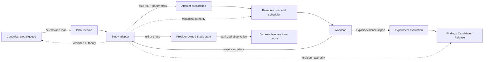
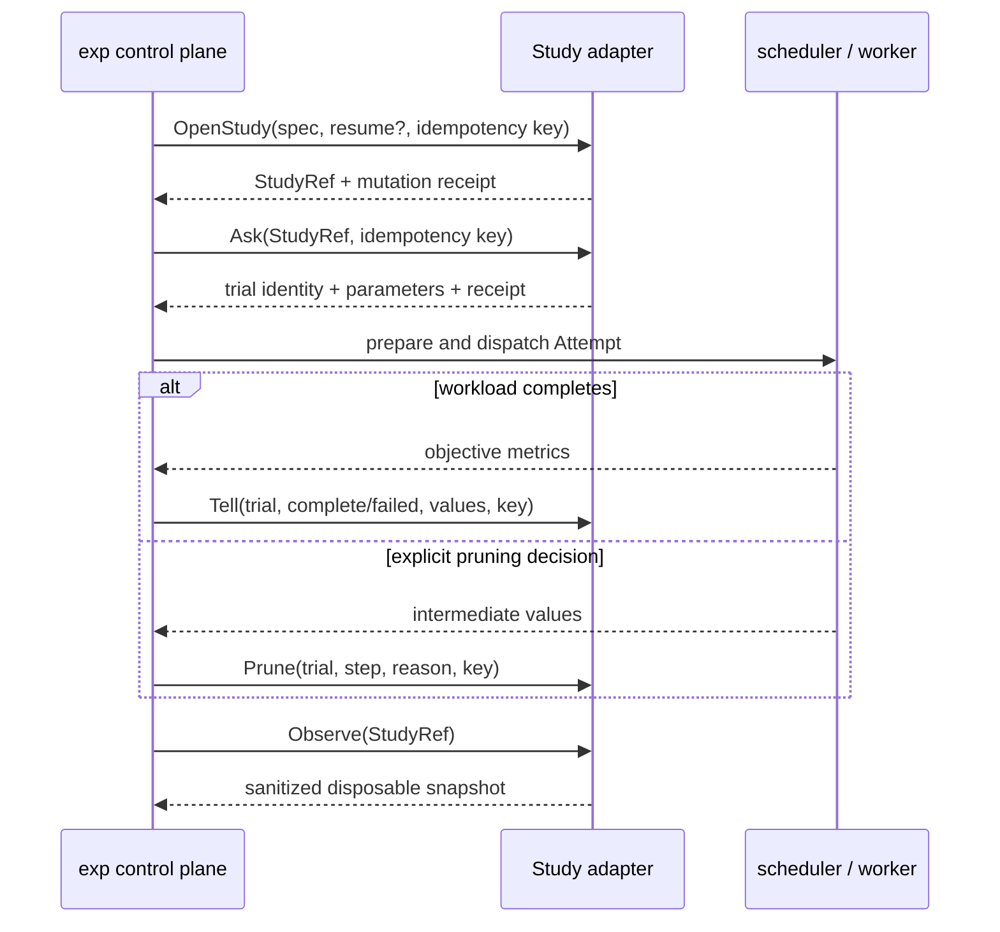

# Study search adapter contract

## Decision

`exp` supports Optuna-like search through a provider-neutral, versioned Study adapter contract. A Study is always subordinate to exactly one canonical Plan revision. The search system may suggest parameters and account for trials, but it is not a second research control plane.

The first contract is implemented in `internal/searchadapter` as `exp.search-adapter/v1`. This milestone does **not** install Optuna, add a Python runtime, contact a storage backend, start a service, or perform authentication. A concrete Optuna adapter can be added later against this contract after its executable, storage, and failure semantics are reviewed.

## Authority boundary

The boundary is returned as part of every adapter descriptor and validated against a compiled constant. It cannot be expanded by adding a capability name.

| Adapter owns | Adapter explicitly does not own |
|---|---|
| Search-space interpretation inside one Plan Study | Global Plan priority or queue order |
| `ask` trial suggestions | Resource-pool allocation |
| `tell` trial completion/failure accounting | Attempt scheduling or worker execution |
| `prune` accounting for one trial | Experiment closure or scientific verdicts |
| Resuming a provider-owned Study identity | Canonical Findings |
| Disposable, sanitized Study observations | Releases or production Promotions |

Optuna can improve local parameter selection, pruning, and resumability. It cannot decide which research direction deserves scarce GPUs, whether evidence supports a hypothesis, which independent experiments should be combined, or whether an artifact is safe for production.

## Placement in the control plane



The scheduler still owns the Attempt. A workload still owns metric production and any MLflow logging. The lifecycle service still decides whether an Experiment is concluded, abandoned, or superseded. Search observations alone never become canonical evidence.

## Version and capability report

`Describe` returns:

- adapter name and adapter version;
- upstream name and verified upstream version, or an empty version when unknown;
- exact contract version `exp.search-adapter/v1`;
- a tri-state report for every v1 capability;
- the fixed authority boundary.

The closed v1 capability set is:

```text
study.open
study.resume
trial.ask
trial.tell
trial.prune
study.observe
```

Support is `supported`, `unsupported`, or `unknown`. Missing packages, unreachable storage, unknown versions, and inconclusive feature probes remain `unknown`; they are never promoted optimistically. A future probe must state whether it executes a local binary or contacts a configured backend.

## Study scope and external identity

A `StudySpec` contains:

- canonical typed Plan ID;
- exact Plan revision;
- a Plan-local Study key;
- one or more named objectives and directions;
- a bounded v1 search space;
- a deterministic SHA-256 search-space digest.

The initial common search space supports float ranges, integral ranges, and tagged categorical scalar values. Provider-specific sampler/pruner configuration belongs in an explicit later adapter configuration, not in canonical research conclusions.

`OpenStudy` either creates a Study or receives a complete `ExternalStudyIdentity` to resume. The identity contains adapter name, a non-secret configured context, provider Study ID, and an optional display-safe URI. The context selects storage or an upstream profile outside the record; credentials, connection strings with secrets, and authentication tokens are forbidden. Every later `ask`, `tell`, `prune`, and `observe` request carries the complete `StudyRef` so an adapter cannot accidentally mutate a Study belonging to another Plan.

Changing the Plan revision or search-space digest requires an explicit new Study or a future reviewed compatibility operation. It is not silently treated as a resume.

## Idempotency and recovery

`OpenStudy`, `ask`, `tell`, and `prune` are mutations and require an idempotency key. An adapter durably stores:

```text
idempotency key
SHA-256 digest of the normalized request
original result / provider mutation identity
applied time
```

For a repeated key:

- the same request digest returns the original semantic result with `replayed: true`;
- a different request digest returns `ErrIdempotencyConflict` and performs no mutation.

This is especially important for `ask`: retrying after a timeout must return the same trial instead of consuming a second suggestion. Durable storage and the upstream mutation should be committed atomically where the upstream supports it. Otherwise the concrete adapter must document its prepared/outbox recovery protocol before it can report the capability as supported.

The resumable external Study identity is stored by the caller before trial dispatch. A daemon restart can therefore resume the provider Study and reconcile a sanitized snapshot without inferring scientific state from scheduler state.

## Trial lifecycle



`tell` accepts only `complete` or `failed`; pruned is a separate operation so retry keys and audit meaning do not overlap. Completion metrics are finite numbers keyed by objective name. A concrete integration must compare returned parameter names and objective names with the original `StudySpec` before workload execution or evidence import.

## Observation and privacy boundary

Adapter observations are untrusted provider state. Before an observation crosses the boundary:

- Study/trial identities must remain byte-for-byte safe; an identity is rejected rather than silently redacted;
- URI userinfo and credential-like query fields are removed;
- arbitrary metadata is copied through the shared bounded structured redactor;
- recursively nested environment maps are removed;
- known secret canaries and credential-bearing fields are redacted;
- diagnostic, source, native-state, and reason text is bounded and single-line;
- NaN and infinity metrics are rejected;
- unknown Study or trial states map to `unknown` and retain only a sanitized native token;
- observation time is normalized to UTC;
- duplicate trial identities are rejected.

The resulting snapshot may be cached in SQLite as operational state. It cannot change queue order, close an Experiment, create a Finding, select a Release, or approve a Promotion without a separate explicit canonical transaction.

## Concrete Optuna adapter requirements

A later Optuna adapter should use public, versioned Optuna storage and ask/tell APIs. Before enabling it, the implementation must document and test:

1. supported Optuna version range and capability probes;
2. local versus remote storage effects and timeout behavior;
3. storage-context configuration with secret references only;
4. transactional behavior for idempotent `ask`, `tell`, and `prune`;
5. mapping for multi-objective directions and trial states;
6. bounded native JSON parsing and sanitization;
7. interruption and retry behavior around provider commit ambiguity.

If the implementation uses a user-supplied sidecar, the preferred transport is one strict JSON object per line with request ID, method, contract version, payload, and a bounded response. The sidecar executable and environment must be explicitly configured and invoked with argument preservation. `exp` must not invoke `python`, `uvx`, `pip`, or another resolver implicitly, and it must not install Optuna or initiate network/auth flows on the user's behalf.
