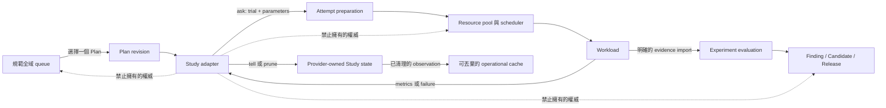
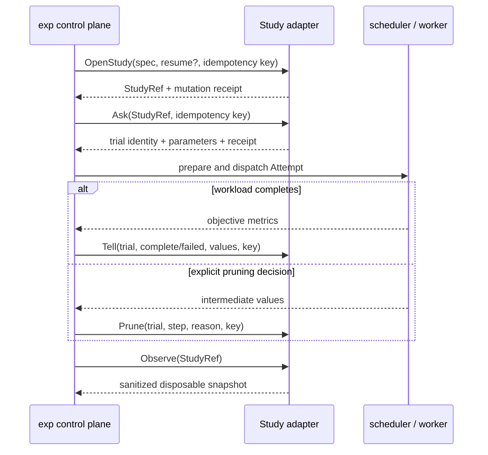

# Study 搜尋 adapter 契約

!!! note "Terminology rule (zh-TW pages)"
    技術名詞首次出現以「中文 (English original)」格式呈現，例：依賴注入
    (dependency injection)。**不自創翻譯**——若無公認譯名直接保留英文
    （如 `embedding`、`tokenizer`）。代碼、API 名、CLI flag、套件名、檔名一律不翻。

## 決策

`exp` 透過供應者中立 (provider-neutral)、版本化的 Study adapter 契約支援類似 Optuna 的搜尋。
一個 Study 永遠只從屬於恰好一個 canonical Plan revision。search system 可以建議 parameters 並記錄 trials，
但它不是第二個 research control plane。

第一版契約已在 `internal/searchadapter` 中實作為 `exp.search-adapter/v1`。此里程碑**不會**安裝 Optuna、
加入 Python runtime、連絡 storage backend、啟動 service 或執行 authentication。具體的 Optuna adapter
可在日後審查其 executable、storage 與 failure semantics 後，依此契約加入。

## 權威邊界

每個 adapter descriptor 都會回傳此邊界，並以已編譯的 constant 驗證。加入 capability name 並不能擴張它。

| Adapter 擁有 | Adapter 明確不擁有 |
|---|---|
| 單一 Plan Study 內的 search-space interpretation | 全域 Plan priority 或 queue order |
| `ask` trial suggestions | Resource-pool allocation |
| `tell` trial completion/failure accounting | Attempt scheduling 或 worker execution |
| 單一 trial 的 `prune` accounting | Experiment closure 或 scientific verdicts |
| 恢復 provider-owned Study identity | Canonical Findings |
| 可丟棄且已清理的 Study observations | Releases 或 production Promotions |

Optuna 可以改善區域 parameter selection、pruning 與 resumability。它不能決定哪個 research direction
值得使用稀缺 GPUs、證據是否支持 hypothesis、哪些獨立 experiments 應該合併，或 artifact 是否可安全用於 production。

## 在控制平面中的位置



scheduler 仍然擁有 Attempt。workload 仍然擁有 metric production 與所有 MLflow logging。
lifecycle service 仍然決定 Experiment 是 concluded、abandoned 或 superseded。單憑 search observations
永遠不會成為 canonical evidence。

## 版本與 capability report

`Describe` 會回傳：

- adapter name 與 adapter version；
- upstream name 及經驗證的 upstream version；若未知則為空 version；
- 精確的 contract version `exp.search-adapter/v1`；
- 每項 v1 capability 的三態 report；
- 固定的 authority boundary。

封閉的 v1 capability set 為：

```text
study.open
study.resume
trial.ask
trial.tell
trial.prune
study.observe
```

support 狀態為 `supported`、`unsupported` 或 `unknown`。缺少 packages、無法連線的 storage、
未知 versions 與無法下結論的 feature probes 都維持 `unknown`；絕不樂觀地提升其狀態。
日後的 probe 必須表明它會執行 local binary，還是連絡 configured backend。

## Study scope 與 external identity

`StudySpec` 包含：

- canonical typed Plan ID；
- 精確的 Plan revision；
- Plan-local Study key；
- 一個或多個具名 objectives 與 directions；
- 有界的 v1 search space；
- 決定性的 SHA-256 search-space digest。

初始的 common search space 支援 float ranges、integral ranges 與帶 tag 的 categorical scalar values。
provider-specific sampler/pruner configuration 應放在日後明確的 adapter configuration，
而不是 canonical research conclusions 中。

`OpenStudy` 會建立 Study，或接收完整的 `ExternalStudyIdentity` 以恢復既有 Study。identity 包含 adapter name、
不含 secret 的 configured context、provider Study ID，以及選用的 display-safe URI。context 會選擇 record 外部的 storage
或 upstream profile；credentials、含 secrets 的 connection strings 與 authentication tokens 均禁止使用。
之後的每個 `ask`、`tell`、`prune` 與 `observe` request 都會攜帶完整 `StudyRef`，
避免 adapter 意外 mutation 屬於另一個 Plan 的 Study。

變更 Plan revision 或 search-space digest 時，必須明確建立新的 Study，或使用日後經審查的 compatibility operation；
不得默默將其視為 resume。

## 冪等性與復原

`OpenStudy`、`ask`、`tell` 與 `prune` 都是 mutations，且必須提供冪等鍵 (idempotency key)。adapter 會持久儲存：

```text
idempotency key
SHA-256 digest of the normalized request
original result / provider mutation identity
applied time
```

對於重複的 key：

- 相同 request digest 會回傳原本的 semantic result，並設為 `replayed: true`；
- 不同 request digest 會回傳 `ErrIdempotencyConflict`，且不執行任何 mutation。

這對 `ask` 尤其重要：timeout 後重試必須回傳同一個 trial，而不是消耗第二個 suggestion。
在 upstream 支援時，durable storage 與 upstream mutation 應以原子方式提交。否則，具體 adapter 必須先記錄其
prepared/outbox recovery protocol，才可以將 capability 回報為 supported。

呼叫端會在 trial dispatch 前儲存可恢復的 external Study identity。因此 daemon 重新啟動後，可以恢復 provider Study，
並協調一份已清理的 snapshot，而不會從 scheduler state 推斷 scientific state。

## Trial lifecycle



`tell` 只接受 `complete` 或 `failed`；pruned 是獨立 operation，使 retry keys 與 audit meaning 不會重疊。
completion metrics 必須是以 objective name 為 key 的 finite numbers。具體 integration 必須在 workload execution
或 evidence import 前，比對回傳的 parameter names 與 objective names 是否符合原始 `StudySpec`。

## Observation 與隱私邊界

Adapter observations 是不受信任的 provider state。observation 跨越邊界前：

- Study/trial identities 必須維持逐 byte 安全；不安全的 identity 會遭拒，而不是被默默 redacted；
- 移除 URI userinfo 與類似 credential 的 query fields；
- arbitrary metadata 透過共用且有界的 structured redactor 複製；
- 移除遞迴巢狀的 environment maps；
- 已知的 secret canaries 與攜帶 credential 的 fields 會被 redacted；
- diagnostic、source、native-state 與 reason text 必須有界且為單行；
- 拒絕 NaN 與 infinity metrics；
- 未知的 Study 或 trial states 會 map 到 `unknown`，且只保留已清理的 native token；
- observation time 會正規化為 UTC；
- 拒絕重複的 trial identities。

產生的 snapshot 可以作為 operational state 快取於 SQLite。沒有另外一筆明確的 canonical transaction，
它就不能改變 queue order、關閉 Experiment、建立 Finding、選擇 Release 或核准 Promotion。

## 具體 Optuna adapter 的要求

日後的 Optuna adapter 應使用公開且版本化的 Optuna storage 與 ask/tell APIs。啟用前，此實作必須記錄並測試：

1. 支援的 Optuna version range 與 capability probes；
2. local 與 remote storage effects，以及 timeout behavior；
3. 僅使用 secret references 的 storage-context configuration；
4. idempotent `ask`、`tell` 與 `prune` 的 transactional behavior；
5. multi-objective directions 與 trial states 的 mapping；
6. 有界的 native JSON parsing 與 sanitization；
7. provider commit ambiguity 前後的 interruption 與 retry behavior。

若實作使用由使用者提供的 sidecar，建議 transport 採用每行一個 strict JSON object，包含 request ID、method、
contract version、payload 及有界 response。sidecar executable 與 environment 必須明確設定，並以保留 arguments
的方式呼叫。`exp` 不得隱式呼叫 `python`、`uvx`、`pip` 或其他 resolver，也不得代替使用者安裝 Optuna
或啟動 network/auth flows。
