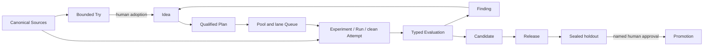

# exp

`exp` is a Git-native autonomous research control plane for deciding which
experiments deserve scarce compute, executing selected work safely, and
preserving the path from a bounded question to a production decision.

A Project's canonical records can live in a dedicated private experiment
repository, independent from the Git repositories it studies. Ordinary Source
records identify those repositories/subdirectories; private local associations
locate checkouts without putting host paths into research history. Embedded and
monorepo Projects remain supported.

## The research loop

A Try may explicitly capture bounded dirty state, but cannot directly become a
Candidate. Promotion-bearing evidence requires a clean formal Attempt,
Evaluation v2 bound to that Attempt, and Candidate v2 that copies its exact
Source identities.

## Choose the next command

| Need | Route | Start |
|---|---|---|
| Explore a short bounded question | Quick Try | `exp guide quick` → `exp try run` |
| Produce governed comparable evidence | Rigorous Experiment | `exp guide research` → `exp idea add` |
| Move validated evidence toward a target | Promotion | `exp guide promotion` → `exp candidate create` |

A new workspace starts one step earlier: `exp guide setup`, then
`exp guide workspaces` and `exp guide config`. Resume at any time with
`exp context`; use `exp <command> --help` for syntax, shell completion for local
IDs, and `exp ui` for a read-only overview.

## Start here

- [Why exp exists](why-exp.md) explains the original pain points.
- [Research principles](research-principles.md) defines the evidence method and
  clean promotion gate.
- [Getting started](getting-started.md) covers dedicated/embedded initialization,
  Sources, a direct Try, and the formal queue.
- [Core research workflow](workflows/core-workflow.md) follows work from
  exploration and Ideas through evidence.
- [Runtime dispatch](workflows/runtime-dispatch.md) explains direct Try and
  cross-repository formal runtime v2.
- [Tools](tools/index.md) documents MLflow, Pueue, Git/worktrees, optional
  providers, and their authority boundaries.
- [Records and authority](reference/records-and-authority.md) is the concise
  owner map.

## One owner for each kind of truth

| Concern | Authority |
|---|---|
| Project identity and research meaning | Markdown/TOML records in the selected experiment repository |
| Source identity/subdir | Canonical Source record |
| Local Project/Source checkout path | Private XDG association store, revalidated against Git |
| Execution-bearing config approval | Exact-digest XDG trust receipt; never canonical identity |
| Source history, exact changes, and worktree lifecycle | Native Git |
| Local formal scheduling | Pueue |
| Workload telemetry and artifact bytes | Workload plus MLflow |
| Leases, jobs, and recovery counters | Private SQLite control state |
| Scientific metric outcome | Evaluation; v2 binds a formal Attempt |
| Reusable source result | Candidate; v2 copies clean SourceSnapshots |
| Production promotion | Sealed holdout plus a named human decision |

Generated views, Champion manifests, provider snapshots, and the read-only
`exp ui` are useful observations. They are never read back as canonical research
meaning and cannot approve a mutation.

Large datasets, model/checkpoint bytes, artifact files, traces, and unbounded
logs remain in MLflow, DVC, or object storage. Git receives bounded summaries,
digests, exact identities, and sanitized references only.

## LLM-readable documentation

The deployment also publishes [`llms.txt`](https://daviddwlee84.github.io/exp-cli/llms.txt)
and [`llms-full.txt`](https://daviddwlee84.github.io/exp-cli/llms-full.txt).
Traditional Chinese equivalents live under
[`/zh-TW/`](https://daviddwlee84.github.io/exp-cli/zh-TW/llms.txt).
