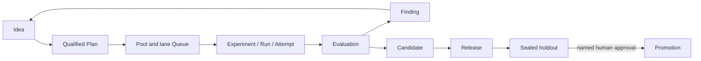

# exp

`exp` is a Git-native autonomous research control plane for deciding which
experiments deserve scarce compute, executing selected work safely, and
preserving the path from an idea to a production decision.

It is designed for research teams where humans and agents both propose work,
but evidence, resource use, and production changes still need explicit,
reviewable authority.

## The research loop

## Start here

- [Why exp exists](why-exp.md) explains the original pain points and how the
  control plane addresses them.
- [Research principles](research-principles.md) captures the methodology that
  should guide experiments even when automation is disabled.
- [Getting started](getting-started.md) installs the CLI and walks through a
  minimal research loop.
- [Core research workflow](workflows/core-workflow.md) follows records from an
  Idea through evidence and follow-up work.
- [Tools](tools/index.md) explains the boundaries with MLflow, Pueue, Git, and
  future integrations.

## One owner for each kind of truth

| Concern | Authority |
|---|---|
| Research meaning and lineage | Markdown/TOML records committed to Git |
| Source history and exact changes | Git commits and worktrees |
| Local task execution | Pueue |
| Workload telemetry | MLflow |
| Leases, jobs, and recovery counters | Private SQLite control state |
| Production promotion | A sealed holdout plus a named human decision |

Generated views and provider snapshots are useful observations, but they are
never read back as canonical research meaning.

## LLM-readable documentation

The deployment also publishes [`llms.txt`](https://daviddwlee84.github.io/exp-cli/llms.txt)
and [`llms-full.txt`](https://daviddwlee84.github.io/exp-cli/llms-full.txt).
Traditional Chinese equivalents live under
[`/zh-TW/`](https://daviddwlee84.github.io/exp-cli/zh-TW/llms.txt).
