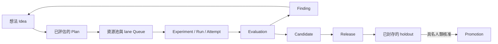

# exp

!!! note "Terminology rule (zh-TW pages)"
    技術名詞首次出現以「中文 (English original)」格式呈現。若無公認譯名，
    直接保留英文。程式碼、API 名、CLI flag、套件名與檔名一律不翻。

`exp` 是一套以 Git 為原生基礎的自主研究控制平面 (autonomous research
control plane)，用來判斷哪些實驗值得使用稀缺運算資源、安全執行被選中的
工作，並保存從研究想法一路到正式環境決策的完整脈絡。

它適合人類與 Agent 都會提出研究工作的團隊，同時要求證據、資源使用與
正式環境變更仍有清楚、可審查的權責。

## 研究循環

## 從這裡開始

- [為什麼需要 exp](why-exp.md)說明最初的痛點，以及控制平面如何處理它們。
- [研究心法](research-principles.md)整理即使沒有自動化也應遵守的實驗方法。
- [快速開始](getting-started.md)說明 CLI 安裝與最小研究循環。
- [核心研究流程](workflows/core-workflow.md)串起從 Idea、證據到後續工作的 records。
- [工具](tools/index.md)說明 MLflow、Pueue、Git 與未來整合的權責邊界。

## 每種事實只有一個權威來源

| 關注事項 | 權威來源 (authority) |
|---|---|
| 研究意義與 lineage | 提交到 Git 的 Markdown/TOML records |
| 原始碼歷史與精確變更 | Git commits 與 worktrees |
| 本機工作執行 | Pueue |
| Workload telemetry | MLflow |
| Leases、jobs 與 recovery counters | 私有 SQLite control state |
| 正式環境 promotion | 已封存的 holdout 加上具名人類決策 |

產生式 view 與 provider snapshot 都是有用的觀察，但絕不會被當作 canonical
research meaning 讀回系統。

## 供 LLM 使用的文件

部署結果也會發布 [`llms.txt`](https://daviddwlee84.github.io/exp-cli/zh-TW/llms.txt)
與 [`llms-full.txt`](https://daviddwlee84.github.io/exp-cli/zh-TW/llms-full.txt)。
英文版本位於網站根目錄。
