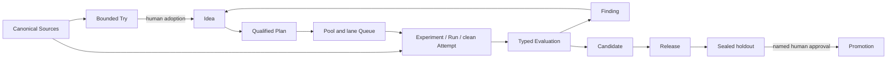

# exp

`exp` 是 Git-native autonomous research control plane，用來判斷哪些 experiment 值得使用 scarce
compute、安全執行 selected work，並保存從 bounded question 到 production decision 的路徑。

Project canonical records 可位於 dedicated private experiment repository，獨立於受研究的 Git
repositories。一般 Source records 識別 repositories/subdirectories；private local association 定位
checkout，不把 host path 放進 research history。Embedded/monorepo Project 仍受支援。

## 研究循環

Try 可 explicit capture bounded dirty state，但不能直接變成 Candidate。Promotion-bearing evidence
要求 clean formal Attempt、綁定該 Attempt 的 Evaluation v2，以及複製 exact Source identities 的
Candidate v2。

## 選擇下一個 command

| Need | Route | 開始 |
|---|---|---|
| Explore short bounded question | Quick Try | `exp guide quick` → `exp try run` |
| Produce governed comparable evidence | Rigorous Experiment | `exp guide research` → `exp idea add` |
| Move validated evidence toward target | Promotion | `exp guide promotion` → `exp candidate create` |

New workspace 要早一步開始：`exp guide setup`，接著 `exp guide workspaces` 與
`exp guide config`。任何時候用 `exp context` resume；syntax 使用
`exp <command> --help`，local ID 使用 shell completion，read-only overview 使用 `exp ui`。

## 從這裡開始

- [為什麼需要 exp](why-exp.md)說明最初 pain points。
- [研究心法](research-principles.md)定義 evidence method 與 clean promotion gate。
- [快速開始](getting-started.md)說明 dedicated/embedded initialization、Sources、direct Try 與 formal
  Queue。
- [核心研究流程](workflows/core-workflow.md)串起 exploration/Idea 與 evidence。
- [執行與派送](workflows/runtime-dispatch.md)說明 direct Try 與 cross-repository formal runtime v2。
- [工具](tools/index.md)記錄 MLflow、Pueue、Git/worktree、optional provider 與 authority boundary。
- [Records 與 Authority](reference/records-and-authority.md)提供 concise owner map。

## 每種事實只有一個 authority

| Concern | Authority |
|---|---|
| Project identity 與 research meaning | Selected experiment repository 中的 Markdown/TOML records |
| Source identity/subdir | Canonical Source record |
| Local Project/Source checkout path | Private XDG association store，並依 Git revalidate |
| Execution-bearing config approval | Exact-digest XDG trust receipt；絕非 canonical identity |
| Source history、exact change、worktree lifecycle | Native Git |
| Local formal scheduling | Pueue |
| Workload telemetry 與 artifact bytes | Workload 加 MLflow |
| Lease、job、recovery counter | Private SQLite control state |
| Scientific metric outcome | Evaluation；v2 綁定 formal Attempt |
| Reusable source result | Candidate；v2 複製 clean SourceSnapshots |
| Production promotion | Sealed holdout 加具名 human decision |

Generated view、Champion manifest、provider snapshot 與 read-only `exp ui` 都是 useful observation；
絕不讀回成 canonical research meaning，也不能核准 mutation。

Large datasets、model/checkpoint bytes、artifact files、traces 與 unbounded logs 留在 MLflow、
DVC 或 object storage。Git 只接收 bounded summaries、digests、exact identities 與 sanitized
references。

## 供 LLM 使用的文件

部署結果也發布 [`llms.txt`](https://daviddwlee84.github.io/exp-cli/zh-TW/llms.txt)與
[`llms-full.txt`](https://daviddwlee84.github.io/exp-cli/zh-TW/llms-full.txt)。英文版本位於網站
root。
