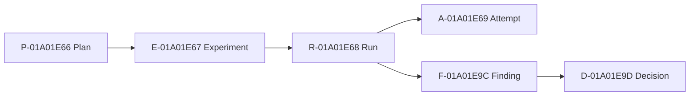

<!-- Generated by exp render; DO NOT EDIT. -->

# Synthetic Encoder Study

Project `01a01e66-0e80-7101-8000-000000000101`

## Inventory

| Plans | Experiments | Runs | Attempts | Findings | Decisions |
|---:|---:|---:|---:|---:|---:|
| 1 | 1 | 1 | 1 | 1 | 1 |

## Experiments

| Experiment | Lifecycle | Closure | Verdict | Title |
|---|---|---|---|---|
| [E-01A01E67](e-01a01e67-calibrate-encoder-learning-rate/REPORT.md) | closed | concluded | supported | Calibrate encoder learning rate |

## Research graph

